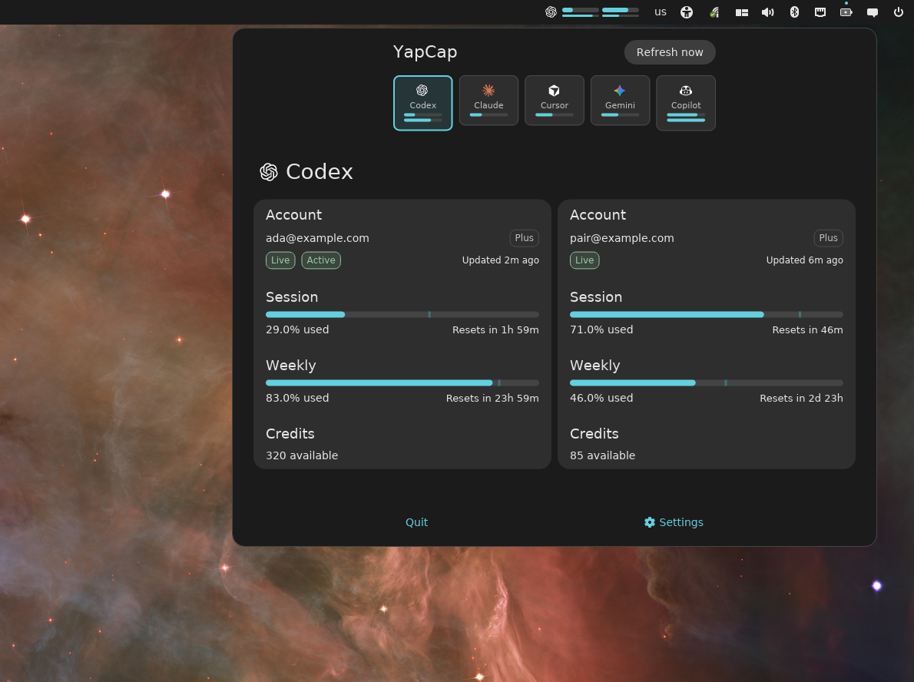
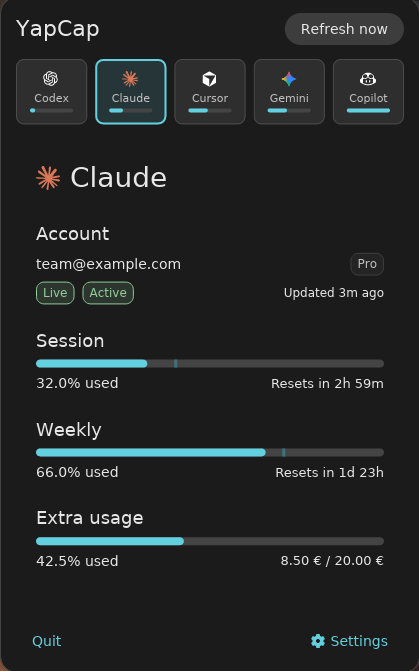
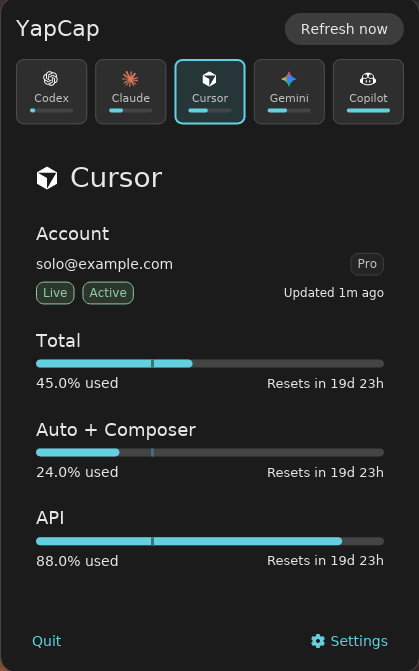
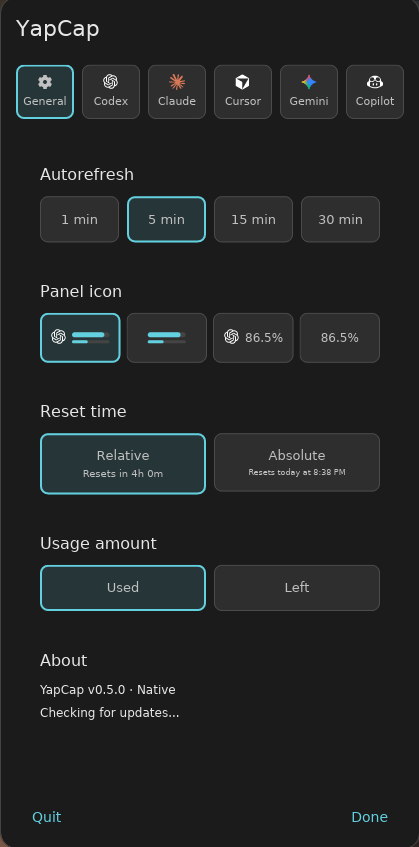
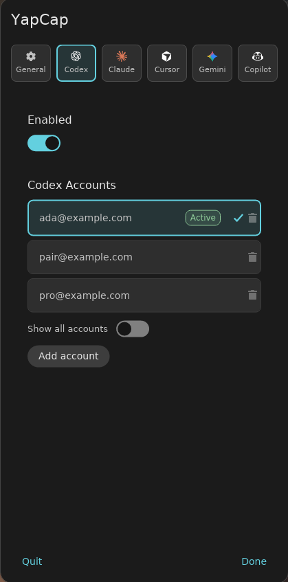

<div align="center">

# YapCap

**A native COSMIC panel applet that tracks AI coding quota for Codex, Claude Code, Cursor, Gemini, and GitHub Copilot.**



[](https://github.com/TopiCsarno/yapcap/actions/workflows/ci.yml)
[](https://github.com/TopiCsarno/yapcap/releases/latest)
[](LICENSE)

[Report a bug](https://github.com/TopiCsarno/yapcap/issues)

</div>

---

## What it does

YapCap lives in your COSMIC panel and shows how much of your AI coding quota you've used — without sending anything to a third party. All data is fetched directly from provider APIs using accounts you add in YapCap. No telemetry, no cloud sync, no separate account needed.


## Highlights

- **Five providers**
    - **Codex** — 5h/weekly windows + credits
    - **Claude Code** — session/weekly/extra usage
    - **Cursor** — plan usage + billing cycle end
    - **Gemini** — Pro / Flash / Lite quota bars (OAuth accounts only)
    - **GitHub Copilot** — Free chat/completions or paid premium interactions
- **Multi-account view** — add, switch, and remove accounts per provider. Turn on **Show all accounts** to lay out each selected account side by side in the popup and show one usage-bar group per account in the panel.
- **Active badge** — YapCap reads your local Codex, Claude Code, and Gemini session state to mark which account is currently active in the host CLI. Copilot has no Active badge because its host token is not stored in a stable readable file.
- **In-app login** — guided login flows for Codex, Claude, Gemini, and Copilot without leaving YapCap or opening a terminal; Cursor scans the local Cursor IDE account state
- **Explicit accounts** — credentials are added through YapCap and stored under YapCap-owned account directories
- **Configurable panel** — logo+bars, bars only, logo+%, or %-only; used/left toggle; relative or absolute reset times
- **COSMIC themes** — popup and panel respect your system theme, accent, and icon context
- **Available in the COSMIC Store** — install the Flatpak from COSMIC Store and receive updates through the normal COSMIC update flow.

## Screenshots

Copilot screenshots are pending capture; the current screenshots show the shared panel, popup, and settings surfaces used by all providers.

<table>
<tr>
<td align="center" valign="top" width="25%">

<strong>Claude usage</strong><br />


</td>
<td align="center" valign="top" width="25%">

<strong>Cursor usage</strong><br />


</td>
<td align="center" valign="top" width="25%">

<strong>Settings — General</strong><br />


</td>
<td align="center" valign="top" width="25%">

<strong>Settings — Accounts</strong><br />


</td>
</tr>
<tr>
<td colspan="4" align="center">

<strong>COSMIC system theme</strong><br />
YapCap follows your COSMIC system theme—the popup and panel pick up light or dark mode and accent colors from your desktop appearance settings.

</td>
</tr>
<tr>
<td align="center" valign="top" width="25%">

</td>
<td align="center" valign="top" width="25%">

</td>
<td align="center" valign="top" width="25%">

</td>
<td align="center" valign="top" width="25%">

</td>
</tr>
</table>

## Install

### COSMIC Store (recommended)

Install **YapCap** from the COSMIC Store and receive automatic updates. 

If you prefer the command line and have the COSMIC Flatpak remote configured:

```bash
flatpak remote-add --if-not-exists --user cosmic https://apt.pop-os.org/cosmic/cosmic.flatpakrepo
flatpak install --user cosmic io.github.TopiCsarno.YapCap
```

### apt (Debian/Ubuntu/Pop!\_OS)

```bash
sudo apt install ./yapcap_*.deb
```

### rpm (Fedora/openSUSE)

```bash
sudo rpm -i ./yapcap_*.rpm
```

Download packages from the [latest release](https://github.com/TopiCsarno/yapcap/releases/latest).

### From source

Requires COSMIC development dependencies and a Rust toolchain.

```bash
git clone https://github.com/TopiCsarno/yapcap
cd yapcap
just install
```

## Quickstart

1. After installing, got to COSMIC Settings app  Desktop → Panel → Configure panel applets
2. Add **YapCap** from the panel applet picker.
3. On first launch, add accounts explicitly from **Settings → [Provider] → Add account**. Codex, Claude, Gemini, and Copilot use browser login flows, and Cursor scans the local Cursor IDE account state.
4. Click the panel button to open the popup.
5. To add more accounts or switch between them, open the popup → **Settings → [Provider]**.

---

## Accounts

Each provider supports multiple accounts. Manage them from the popup under **Settings → [Provider]**.

- **Add account** — triggers the provider's own login flow: Codex browser OAuth, native Claude OAuth in the browser, Gemini browser OAuth, GitHub Copilot browser device flow, or Cursor IDE account scanning, without leaving YapCap.
- **Switch account** — tap any account row to make it active; the panel and popup update immediately.
- **Remove account** — deletes only YapCap's copy of the credentials. Provider accounts and host app configs are never touched.

Codex, Claude, Cursor, and Gemini keep at most one account per email address. Copilot keeps at most one account per GitHub numeric user id and displays the current GitHub username.

## Panel styles

Configured under **Settings → General**:

| Style | What's shown |
| --- | --- |
| Logo + bars | Provider icon and two compact usage bars (default) |
| Bars only | Two usage bars, no icon |
| Logo + percent | Provider icon and the headline window as a percentage |
| Percent only | Headline percentage only |

## Display options

Also under **Settings → General**:

- **Usage format** — show quota as *used* (how much you've consumed) or *left* (how much remains).
- **Reset time format** — relative durations (`Resets in 2d 4h`) or absolute local times (`Resets Wednesday at 8:25 AM`).
- **Auto-refresh interval** — how often YapCap polls the provider APIs in the background.

Usage bars include a pace indicator: a vertical marker shows expected usage for the elapsed portion of the window so you can see at a glance whether you're running ahead or behind.

## Updates

YapCap checks GitHub for a new release on startup. If one is available, a red dot appears on the Settings icon and a link to the release page appears in **Settings → About**. No automatic download or install.

## Privacy

YapCap stores provider credentials under YapCap-owned account storage and calls provider APIs directly over HTTPS. Claude OAuth refresh uses Anthropic’s token endpoint, not the Claude CLI. Codex login runs inside a temporary YapCap-owned CLI home and is converted into YapCap account storage. Logs never contain credentials, bearer tokens, or cookie values — if you find one leaking, please file a bug.

## Troubleshooting

- **Applet doesn't appear after install** — restart the COSMIC session (log out and back in).
- **Auth error on Codex** — open **Settings → Codex**, remove the account if needed, and add it again to complete the managed login flow.
- **Auth error on Claude** — open **Settings → Claude**, remove the account if needed, and add it again to complete the browser OAuth flow.
- **Cursor shows no data** — log into Cursor IDE, then open **Settings → Cursor** and use **Add account** to re-scan the Cursor session.
- **Stale data** — a transient failure keeps the last good snapshot visible and marks it stale. Click **Refresh now** once the network or provider is back.

Logs (native): `~/.local/state/yapcap/logs/yapcap.log`. Logs (Flatpak): `~/.var/app/io.github.TopiCsarno.YapCap/data/yapcap/logs/yapcap.log`.

## File locations

**Native** (typical XDG defaults):

| Path | Purpose |
| --- | --- |
| `~/.config/cosmic/io.github.TopiCsarno.YapCap/v600/` | Settings (provider toggles, accounts, display options) |
| `~/.cache/yapcap/snapshots.json` | Cached usage state (loaded on startup) |
| `~/.local/state/yapcap/`{`codex`,`claude`,`cursor`,`gemini`,`copilot`}`-accounts/` | Managed credential copies |
| `~/.local/state/yapcap/logs/yapcap.log` | Log output |

**Flatpak** (`io.github.TopiCsarno.YapCap`): YapCap cache and state live only under `~/.var/app/io.github.TopiCsarno.YapCap/` — use `cache/yapcap/` for snapshots and `data/yapcap/` for accounts and logs. The manifest mounts host `~/.config/cosmic` read-write for COSMIC app settings (not `xdg-config/cosmic`, for compatibility with Flatpak path resolution).

## Limitations

- COSMIC only. No GNOME, KDE, or tray fallback.
- No historical charts, notifications, or cost analytics.
- Five providers only for now.
- **Gemini OAuth only.** YapCap meters Gemini accounts authenticated via Google OAuth.
  API-key (`selectedAuthType: gemini-api-key`) and Vertex AI (`selectedAuthType:
  vertex-ai`) gemini-cli configurations are not supported — switch the account to
  OAuth with `gemini auth login` to use YapCap.
- **One Gemini project per account.** YapCap displays the single
  `cloudaicompanionProject` returned by Google's `loadCodeAssist` for each
  account. Users with multiple paid GCP projects see whichever project Google
  selects, not all of them.

## License

MPL-2.0 — see [LICENSE](LICENSE).
