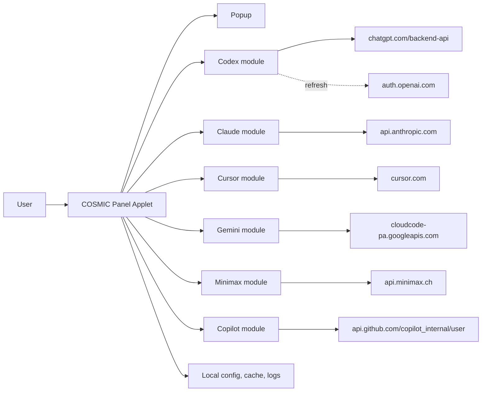
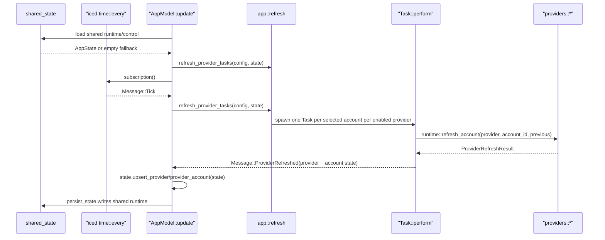

# YapCap — COSMIC Panel Applet Architecture

**Status:** As-built v0.6.0 · **Last updated:** 2026-07-16

## Document Metadata

| Field | Value |
| --- | --- |
| Status | Describes current main branch |
| Target desktop | COSMIC |
| Target language | Rust (edition 2024) |
| Target runtime | libcosmic applet runtime |
| Providers | Codex, Claude Code, Cursor, Gemini, Minimax, GitHub Copilot, Antigravity |

## Document Map

| Area | Subsections |
| --- | --- |
| 1. Product Definition | 1.1 Scope and Non-Goals<br>1.2 Supported Sources |
| 2. Architecture | 2.1 System Context<br>2.2 Crate Layout<br>2.3 Runtime and Message Flow<br>2.4 Multi-Process Applet Model |
| 3. Providers | 3.1 Codex<br>3.2 Claude<br>3.3 Cursor<br>3.4 Copilot<br>3.5 Gemini<br>3.6 Minimax<br>3.7 Antigravity |
| 4. Auth and Config | 4.1 OAuth Credential Files<br>4.2 Cursor Token Source<br>4.3 Configuration |
| 5. Data Model | 5.1 UsageSnapshot<br>5.2 ProviderRuntimeState and Health<br>5.3 Stale/Fresh Rules |
| 6. Persistence, Logging, Paths | |
| 7. User Interface | 7.1 Panel<br>7.2 Popup |
| 8. Packaging | |
| 9. Localization | |
| 10. Testing | |

## 1. Product Definition

### 1.1 Scope and Non-Goals

- YapCap is a native Linux COSMIC panel applet that shows local usage state for Codex, Claude Code, Cursor, Gemini, Minimax, GitHub Copilot, and Antigravity.
- Ships only on COSMIC. No GNOME, KDE, tray, or generic indicator paths exist.
- Reads locally available credentials and caches. No user account, no cloud sync, no telemetry.
- Out of scope: additional providers, historical charts, notifications, plugin architecture, doctor command, secret vault, alternative DEs.

### 1.2 Supported Sources

| Provider | Primary | Fallback |
| --- | --- | --- |
| Codex | Active Codex account resolved from YapCap-owned `metadata.json`/`tokens.json` | Codex OAuth token refresh via `auth.openai.com/oauth/token` before expiry or once after 401/403 |
| Claude | Active Claude account resolved from YapCap-owned `claude-accounts/<id>/` (`tokens.json`, `metadata.json`) | OAuth access-token refresh via `POST https://claude.ai/v1/oauth/token` (`grant_type=refresh_token`) |
| Cursor | Active Cursor account resolved from YapCap-owned `cursor-accounts/<id>/` (`metadata.json`, `tokens.json`, optional `snapshot.json`) | — |
| Gemini | Active Gemini account resolved from YapCap-owned `gemini-accounts/<id>/` (`metadata.json`, `tokens.json`, optional `snapshot.json`) | OAuth refresh-token grant against `oauth2.googleapis.com/token` before expiry or once after a `loadCodeAssist` / `retrieveUserQuota` 401 |
| Copilot | Active GitHub Copilot account resolved from YapCap-owned `copilot-accounts/<id>/` (`metadata.json`, `tokens.json`) | None; token is long-lived and re-auth is user-driven after revocation |

Claude, Codex, Cursor, Gemini, Minimax, and Copilot all use YapCap-managed account storage. There
is no web-cookie path for Claude and no forced-source environment variable.
Gemini supports only Google OAuth accounts; gemini-cli API-key and Vertex AI
configurations are out of scope. Minimax uses API key authentication without host CLI integration.

## 2. Architecture

### 2.1 System Context



### 2.2 Crate Layout

Single-crate workspace. Binary:

- `yapcap` — the released applet, driven by libcosmic's applet runtime.

Binary-only modules (`src/`, compiled only into the applet binary):

| Module | Purpose |
| --- | --- |
| `app` | `src/app/` module tree. `mod.rs` owns `AppModel`, `Message`, and the libcosmic `Application` impl. Submodules split applet rendering, popup/window sizing, login flows, provider refresh/account actions, popup UI, provider icon assets, host CLI auth file watching (`host_auth_watch`, inotify on Linux), and app-only unit tests. `popup_view.rs` keeps the top-level popup shell and shared widgets, `popup_view/detail.rs` renders provider detail columns, and `popup_view/settings/` splits general settings from provider/account settings rows and login controls. |
| `i18n` | `fl!()` macro, `i18n_embed` loader wired to `i18n/en/yapcap.ftl`. |

Library modules (`src/`, also usable from tests):

| Module | Purpose |
| --- | --- |
| `runtime` | `refresh_one(provider)`, `refresh_provider(...)`, `load_initial_state`, `persist_state`. Startup state is reconciled from shared runtime config, not from `snapshots.json`. |
| `providers::minimax` | Minimax API key-based account management, usage fetch, and token quota tracking. |
| `providers::registry` | Provider-facing interface used by runtime and UI code. It exposes provider capabilities, account discovery, account deletion, account status refresh, and usage fetch through provider adapters. |
| `providers::adapters` | Provider adapter implementations for Codex, Claude, Cursor, Gemini, Minimax, and Copilot. Each adapter maps the shared provider interface onto provider-specific account and fetch modules. |
| `providers::interface` | Shared provider adapter trait, capability flags, account descriptors, account handles, and async future alias. |
| `providers::codex` | Codex managed login, YapCap-owned account listing, OAuth usage fetch, and refresh-on-401/403 under `src/providers/codex/`. |
| `providers::claude` | Managed native OAuth login and YapCap-owned account listing under `src/providers/claude/`, OAuth usage fetch, token refresh against Anthropic’s OAuth token endpoint (no Claude CLI), and read-only host `~/.claude.json` matching for `system_active_account_id`. |
| `providers::cursor` | Cursor web API via YapCap-owned tokens scanned from Cursor IDE's local SQLite state. |
| `providers::copilot` | GitHub device-flow login, id-based YapCap-owned account listing/dedupe, single-call usage fetch, and Free/paid Copilot schema parsing under `src/providers/copilot/`. |
| `providers::minimax` | API key-based authentication, YapCap-owned account storage, usage quota tracking, and Minimax API integration under `src/providers/minimax/`. |
| `account_storage` | Shared explicit-account storage foundation for provider migrations. It writes account metadata, provider tokens, and per-account cached snapshots as separate JSON files under opaque YapCap-owned account directories. All write entry points (`create_account`, `replace_account`, `save_metadata`, `save_tokens`, `save_snapshot`) create the full account directory chain on demand, so callers do not need to pre-create the provider account root. It also exposes lower-level `create_private_dir`/`set_private_file_permissions`/`write_json`/`read_json` primitives (owner-only `0o700` dirs, `0o600` files) that providers with a bespoke on-disk schema — Copilot and Minimax — use directly instead of hand-rolling their own permission-setting code. |
| `auth` | Parses JWT identity claims used by Codex OAuth compatibility paths. |
| `config` | COSMIC config entry, provider toggles, provider account preferences, and the shared app ID constant used by all COSMIC config entries. |
| `shared_state` | Versioned COSMIC-backed shared runtime and shared control entries. Shared runtime wraps the app runtime payload with generation and write timestamp metadata. Shared control stores per-provider explicit refresh requests with request metadata. |
| `refresh_owner` | OS file-lock based refresh ownership. It creates `refresh-owner.lock` under the YapCap state directory, records per-process diagnostics, distinguishes owner/non-owner/read-only startup states, and supports blocking takeover when the owner exits. |
| `model` | `UsageSnapshot`, `ProviderRuntimeState`, `ProviderHealth`, `AuthState`, `AppState`. |
| `updates` | GitHub release check; `UpdateStatus` and debug-only update simulation. |
| `usage_display` | Shared "expired window" percent/label formatting. |
| `logging` | `tracing` subscriber + file appender init. |
| `error` | `thiserror` enums: `AppError` and per-subsystem types. |

### 2.3 Runtime and Message Flow

The applet is a libcosmic `Application`. Messages flow:



- On startup, `AppModel::init` loads durable config, then loads shared runtime
  and shared control through COSMIC config. Missing or invalid shared runtime
  falls back to an empty `AppState` reconciled with durable config. The refresh
  owner then dispatches automatic refresh for enabled providers whose selected
  accounts are missing runtime data or older than the configured refresh
  interval.
- Each applet process tries to acquire `refresh-owner.lock` under the YapCap
  state directory. The first process to acquire the file lock records itself as
  refresh owner for its process lifetime and clears pending shared refresh
  requests. A contending process records itself as non-owner and starts a
  background blocking wait for takeover. If the wait acquires ownership after
  the previous owner exits, the process transitions to owner state and clears
  pending shared refresh requests. Lock acquisition errors are logged and leave
  the process in read-only/non-owner behavior.
- Every applet instance subscribes to durable config, shared runtime, and shared
  control updates through COSMIC config watching. Shared runtime updates replace
  the local display `AppState` and are reconciled with the current durable
  config before redraw. Shared control updates are retained locally for later
  owner-driven refresh handling.
- The panel opens on the persisted `selected_provider` from config. Selecting a provider tab writes that provider back to config so all applet processes switch to the same provider and the next launch opens on the same provider; if the saved provider is disabled, startup falls back to the first enabled provider. When the selected enabled provider has missing or stale selected-account runtime data, the selecting process writes a provider-selected shared refresh request for the refresh owner.
- Provider enablement is resolved from a per-provider `Auto` / `Enabled` /
  `Disabled` setting. `Auto` enables only providers detected on the machine or
  with a YapCap account; explicit settings override that result. New configs
  use `Auto`, while the one-shot legacy migration preserves prior boolean
  settings as explicit enablement. The settings toggle writes only explicit
  `Enabled` or `Disabled` values.
- Provider detection runs at startup and re-runs after debounced host-auth
  watcher events for its marker paths. A changed detection snapshot reconciles
  effective enablement without polling; stored accounts still keep a provider
  enabled when its marker disappears.
- `Message::Tick` polls automatic-refresh eligibility every 10 seconds. Provider
  data remains eligible only after `refresh_interval_seconds` has elapsed since
  its last successful refresh, so a due refresh can begin up to 10 seconds after
  the configured interval. Only the refresh owner handles timer refresh. Non-owner
  ticks do not refresh providers and do not create refresh requests.
- `Message::RefreshNow` is the popup’s "Refresh now" button. Any applet process
  handles it by writing shared control requests for enabled providers. The
  refresh owner observes those requests, evaluates each provider's refresh
  eligibility, ignores disabled, already-refreshing, and not-ready providers,
  publishes shared runtime with the existing refreshing state before provider
  work, and consumes a provider request after publishing that provider's final
  runtime result. Non-owners never execute provider refresh directly. User-driven
  requests — the "Refresh now" button and account actions — are forced: they
  bypass the per-account backoff timer so a ready provider whose selected account
  is backing off after an error still refreshes (and briefly shows the refreshing
  state) instead of being silently skipped. Accounts that need re-authentication
  (`AuthState::ActionRequired`) are still skipped, since a retry cannot succeed
  without login.
- Before each timer refresh cycle the owner resolves stale refreshes: any provider
  left in the refreshing state for more than 60 seconds (for example because the
  previous owner process exited mid-refresh) is cleared, shown a "Refresh timed
  out" error, and its selected accounts are given a failure backoff. This prevents
  a provider from spinning on "Refreshing" indefinitely.
- Login, re-authentication, account switching, provider enablement, and account
  deletion write account storage and durable config from the process handling
  the user action. Those actions then write a provider-scoped shared refresh
  request; only the refresh owner executes provider refresh and publishes shared
  runtime status, usage snapshots, account health, auth state, refresh errors,
  or runtime cleanup.
- A successful login (or Minimax API key save) clears the login state
  immediately: the account controls return to the normal add-account state with
  no confirmation message or dismiss step. Failed logins keep showing the error
  with `Add another` / `Dismiss` controls.
- Each provider has a persisted `show_all_accounts` setting. When it is off, selecting an account makes that provider single-account and YapCap keeps only one selected account for it. When it is on, the provider can keep multiple selected accounts and render up to four accounts. Enabling it selects at most four account ids per provider: the current active account when still available, then additional stored accounts in stable account order. If older or manually edited state contains more than four selected account ids, the panel and provider detail popup still render only the first four. This is a multi-account selection and rendering cap, not a storage limit.
- Provider HTTP calls use a shared `reqwest::Client` with a 5s connect timeout and 20s total request timeout.
- Refresh dispatch runs only when the provider is enabled and its account resolver is `Ready`.
- When multiple accounts are selected for a provider, `app::refresh` spawns one independent `Task::perform` per account and batches them with `Task::batch`. Results arrive concurrently; the popup rerenders after each individual account completes.
- `runtime::refresh_account` takes an explicit `account_id` and resolves which YapCap-owned account to fetch. If the requested account is not found it falls back to the first available account; if no accounts exist it returns a `LoginRequired` state.
- `runtime::refresh_provider_account` keeps the previous account snapshot on error so the UI never drops data on a transient failure. It instead flips the account’s `ProviderHealth::Error`.

### 2.4 Multi-Process Applet Model

COSMIC can run one YapCap applet process per panel output. YapCap supports that
model directly: each process owns its local surface state, while product state is
coordinated through COSMIC config and a refresh-owner lock.

Shared state:

- Durable user config: selected provider, enabled providers, selected account
  ids, show-all account settings, display preferences, refresh interval, and
  managed account metadata.
- Shared runtime config: the versioned runtime document containing provider and
  account runtime state, usage snapshots, refresh status, generation, and write
  timestamp.
- Shared control config: the versioned refresh-request document containing
  provider-scoped requests, reason, request timestamp, requesting process id,
  generation, and update timestamp.
- YapCap-owned account storage: provider metadata, tokens, and per-account
  snapshots under the native or Flatpak state directory.

Local per-process state:

- Popup open/closed state, popup route, popup size measurements, focus, hover
  state, copied-code hints, login task handles, and in-progress text input.
- Refresh-owner diagnostics such as PID, generated process id, and
  `COSMIC_PANEL_OUTPUT`, which are logged but not stored in shared runtime.

Refresh responsibilities:

- Exactly one process is the refresh owner while it holds
  `refresh-owner.lock` under the YapCap state directory.
- The owner executes startup refresh, timer refresh, and observed shared-control
  refresh requests. It is the only process that writes shared runtime.
- Non-owners do not execute timer refresh and do not write shared runtime. They
  may write durable user config and shared-control refresh requests, then observe
  shared runtime updates from the owner.
- Any process can select a provider, change provider/account settings, add,
  re-authenticate, or delete accounts. Those actions update config/account
  storage immediately and request owner refresh when runtime state needs to
  change.
- Non-owner processes wait for the owner lock in the background. When the owner
  exits or its output disappears, one waiting process takes ownership, clears old
  shared refresh requests, and evaluates startup freshness.

`snapshots.json` is not active runtime state. Existing native and Flatpak
snapshot files are left on disk but are not read or written during normal
runtime behavior; shared runtime through COSMIC config is the cross-process
source of truth.

## 3. Providers

### 3.1 Codex

Codex account model:

- Managed accounts are explicit entries in `Config.codex_managed_accounts`.
  Each entry points at a YapCap-owned account directory under
  `~/.local/state/yapcap/codex-accounts/<id>/` with `metadata.json`,
  `tokens.json`, and optional per-account cached snapshots.
- YapCap does not import ambient `CODEX_HOME`/`~/.codex` accounts at startup.
  Legacy `system` selections are dropped during startup sync.
- `discover_accounts` builds the account list from YapCap-owned metadata and
  requires matching stored tokens. Config metadata is not treated as proof that
  credentials exist.
- Codex account identity is the normalized stored account email (`trim + ASCII
  lowercase`). `provider_account_id` is stored only as non-identity metadata for
  API headers, display, diagnostics, and compatibility.
- If multiple managed Codex entries share the same normalized email, YapCap
  auto-merges them down to one surviving config entry, preferring the active
  account when one is active and otherwise preferring the most recently
  updated/authenticated usable account.
- The active resolver uses the persisted id when it resolves to a valid source,
  otherwise auto-selects exactly one valid source, otherwise reports
  `SelectionRequired` or `LoginRequired`.
- Account display labels are derived from stored account email; stored config
  labels are not used for display when metadata is available.
- Add-account flows select the new Codex account immediately in single-account
  mode. In show-all mode they preserve existing selections and append the new
  account when appropriate.
- Host Codex CLI session hint: YapCap read-only reads `~/.codex/auth.json` to set
  `system_active_account_id` (JWT user id vs stored `provider_account_id`) for the
  **Active** badge. An inotify-backed subscription (via the `notify` crate on Linux)
  reapplies Codex reconciliation when that file is created, modified, removed,
  or atomically replaced; read/access events are ignored so rereading the file
  cannot trigger a self-sustaining reconciliation loop. When the file is missing
  but `~/.codex` exists, the directory is watched for `auth.json` events. Under
  Flatpak, the `~/.codex` / auth path uses the passwd home directory so it stays
  aligned with `finish-args` mounts when `HOME` points at `~/.var/app/...`.

Managed Codex add-account flow:

- Settings exposes `Add account` under the Codex accounts card.
- YapCap starts a localhost callback listener on the official Codex redirect
  port, generates PKCE verifier/challenge and state, opens the Codex
  authorization URL, and streams that URL into the popup as an `Open Browser`
  fallback.
- The authorization URL uses the official public Codex OAuth client id
  `app_EMoamEEZ73f0CkXaXp7hrann`, issuer `https://auth.openai.com`, scope
  `openid profile email offline_access api.connectors.read
  api.connectors.invoke`, `id_token_add_organizations=true`,
  `codex_cli_simplified_flow=true`, and originator `codex_cli_rs`, matching the
  upstream `openai/codex` PKCE login flow.
- The UI shows `Cancel` while login is running. Cancel aborts the login task and
  immediately returns the account controls to the normal add-account state.
- On successful callback, YapCap validates the OAuth state, exchanges the code
  at `https://auth.openai.com/oauth/token` with `grant_type=authorization_code`,
  parses the returned access token, refresh token, `id_token`, expiry, email,
  and ChatGPT account id, attempts one Codex usage request (non-fatal if it
  fails), then stores the account in YapCap-owned account storage. Duplicate
  login by normalized email updates the existing account directory instead of
  creating a duplicate.
- Successful managed Codex refreshes hydrate non-secret config metadata such as
  email and provider account id, and clear the old provider-level legacy
  snapshot once an account-scoped snapshot exists.
- On cancel, failure, or task abort, no account is committed and existing
  account storage is left unchanged.
- Rename is still future work.

Usage request: `GET https://chatgpt.com/backend-api/wham/usage` with:

- `Authorization: Bearer <tokens.access_token>`
- `ChatGPT-Account-Id: <metadata.provider_account_id>` (when present)

Response shape (subset consumed):

- Each non-null `rate_limit.primary_window` and `rate_limit.secondary_window`
  supplies `used_percent` and `reset_at`. YapCap derives the label from
  `limit_window_seconds`: values within 60 seconds of 5h are Session and values
  within 60 seconds of 7d are Weekly. Missing or unknown durations retain the
  positional fallback: primary is Session and secondary is Weekly.
- `credits.balance` (string or number, nullable) → parsed into a `ProviderCost { units: "credits" }`; null or absent balance is silently ignored.

OAuth refresh:

- If `tokens.expires_at` is within five minutes, YapCap calls `POST
  https://auth.openai.com/oauth/token` with `grant_type=refresh_token` and the
  Codex client id, writes the rotated access token, refresh token, and expiry to
  `tokens.json`, then performs the usage request with the fresh access token.
- If the usage endpoint returns HTTP 401 or 403 and `tokens.json` contains a
  refresh token, YapCap performs the same refresh, persists the rotated tokens,
  and retries the usage request once.
- Refresh HTTP 400, 401, and 403 are permanent re-auth failures
  (`requires_user_action = true`). Refresh HTTP 429, HTTP 5xx, network errors,
  and timeouts are transient and preserve any stale snapshot on the account.
- If no refresh token is available, YapCap reports an actionable login-required
  error.

### 3.2 Claude

Claude account model:

- Accounts are explicit entries in `Config.claude_managed_accounts`. Each entry’s
  `config_dir` points at a YapCap-owned directory under
  `~/.local/state/yapcap/claude-accounts/<id>/` with `metadata.json`,
  `tokens.json`, and optional per-account cached snapshots.
- `discover_accounts` builds the in-app account list from those entries. Email
  and organization prefer values from account `metadata.json` when loadable;
  otherwise config fields apply. When email is present, entries dedupe by
  normalized email.
- Host Claude Code session hint: YapCap read-only reads `~/.claude.json`
  (`oauthAccount.accountUuid`, with `emailAddress` as fallback) to set
  `system_active_account_id` for the **Active** badge against stored metadata.
  UUID matches are authoritative when present; email matching is used only when
  the host config has no usable UUID, so untracked host accounts do not mark a
  tracked account active by email.
  Under Flatpak (`FLATPAK_ID`), that path is resolved with the passwd database
  home directory (`pw_dir`), not `dirs::home_dir` / `$HOME`, so it matches the
  bind-mounted host file even when the sandbox overrides `HOME` to
  `~/.var/app/...`. Under Flatpak, the manifest grants read-only home access so
  the host auth watcher can observe `.claude.json` atomic replacements in the
  home directory. The same host auth watcher as Codex reapplies Claude
  reconciliation when `~/.claude.json` changes. Manual refresh also reapplies
  Codex and Claude host-session reconciliation before usage fetches, so the
  **Active** badge rereads host auth files even if Flatpak file watching misses a
  change.
  YapCap does not import host tokens, host credential trees, or run the `claude`
  CLI for login, refresh, or discovery.
- Add-account uses a native OAuth PKCE flow: browser authorization, token
  exchange against Anthropic’s token endpoint, and commit only after the
  response includes required access and refresh tokens, expiry, scope, and
  account email.
- The login paste field accepts only Claude's copied authentication code format
  (`code#state`). Full callback URLs and raw query strings are rejected with
  code-focused guidance.
- Duplicate login by normalized email updates the existing account’s tokens and
  metadata instead of adding a second account.
- Add-account and single-account selection behavior match other providers:
  new accounts are selected immediately in single-account mode; show-all mode
  preserves existing selections when possible.
- Account labels follow the account email when available.
- After a successful usage fetch, `UsageSnapshot.identity.email` uses the usage
  JSON `email` field when present; otherwise stored account metadata’s email
  when non-empty.

Primary: `GET https://api.anthropic.com/api/oauth/usage` with:

- `Authorization: Bearer <access_token>` (current access token from account `tokens.json`)
- `anthropic-beta: oauth-2025-04-20`
- Token must carry scope `user:profile`; otherwise `MissingProfileScope` is returned before the request.
- Before the request, YapCap preflights token expiry. If `expires_at` is within five minutes, YapCap calls `POST https://claude.ai/v1/oauth/token` with `grant_type=refresh_token`, writes updated tokens to account storage (and updates metadata when the response includes identity fields), then continues with the fresh access token and performs exactly one usage request in that cycle.
- If the usage endpoint returns HTTP 401, YapCap attempts one token refresh via the same OAuth token endpoint, persists new tokens when that succeeds, and retries the usage request once immediately with the fresh access token. If the retry also returns 401, the cycle ends as unauthorized without another refresh attempt.

Response shape:

- `five_hour.utilization` / `resets_at` → Session window (utilization is 0..100).
- `seven_day.utilization` / `resets_at` → Weekly window.
- Model-scoped weekly windows come from one of two shapes, in priority order:
  - When `limits` is present and non-empty, each entry with `group == "weekly"` and `kind == "weekly_scoped"` and a non-empty `scope.model.display_name` maps to a weekly window labeled by that `display_name` (e.g. `"Fable"`), using `percent` for fill and `resets_at` for the reset time. Entries without a `percent` are skipped (no data, matching the legacy behavior when `utilization` is absent). Entries are emitted in array order immediately after the Weekly window. `is_active` is not used as a filter (it has been observed `false` on applicable limits). Duplicates are collapsed by `scope.model.id` when present and non-empty, otherwise by `display_name`, keeping the first occurrence. When `limits` is present, the legacy `seven_day_sonnet` / `seven_day_opus` / `seven_day_cowork` fields are ignored.
  - When `limits` is absent or empty, `seven_day_sonnet` / `seven_day_opus` / `seven_day_cowork` map to Sonnet/Opus/Cowork weekly windows (Max plan only; null on Pro).
- When present, Claude maps `extra_usage` to `UsageSnapshot.extra_usage`:
  - `is_enabled: false` → `ExtraUsageState::Disabled` (popup: **Extra usage** with **Disabled** subtitle, no progress bar).
  - otherwise → `ExtraUsageState::Active` with bar fill from `utilization`, or from `(used_credits / monthly_limit) * 100` when utilization is omitted; amounts come from `used_credits` / `monthly_limit` / `currency` (credits scaled by dividing by 100; currency defaults to `"$"` if absent). In the popup, formatted amounts separate the number from the rendered symbol with a space (symbols follow common ISO‑4217 mappings such as `$` for USD, `€` for EUR); hovering the amount line shows the three-letter ISO code in a tooltip.

Claude does not populate `UsageSnapshot.provider_cost` (Codex retains `provider_cost` for credits-only display).

Claude usage windows are partially tolerant because the endpoint can return null fields for inactive or account-specific windows. A window with no `utilization` is skipped. A window with `utilization` but no `resets_at` is kept without reset metadata. If both primary windows are absent after normalization, the provider returns `NoUsageData`. See §5.3 for how zero-usage windows with missing `resets_at` are rendered.

Usage fallback: none. Claude usage is fetched only through the OAuth usage endpoint.

All routine access-token refresh uses `POST https://claude.ai/v1/oauth/token` with `grant_type=refresh_token` and the stored refresh token. The Claude CLI is not involved.

HTTP 429 surfaces as `ClaudeError::RateLimited { retry_after_secs: Option<u64> }`, is marked transient, and displays the message "Rate limited by Claude — will retry automatically", optionally appended with "(retry in Xm)" when a `Retry-After` header is present. Token refresh HTTP 4xx errors other than 429 are permanent re-auth failures (`requires_user_action = true`).

**Refresh backoff:** When a refresh cycle fails for any reason, YapCap records `retry_after` on the per-account state and increments `consecutive_failures`. The delay is taken from the `Retry-After` response header when the error carries one (rate limits); otherwise it uses exponential backoff: `300s * 2^(consecutive-1)`, capped at 3600s. Automatic (timer) refresh cycles skip any account that is still backing off (`retry_after > now`); user-driven refreshes force through the backoff as described above. On the next successful refresh, `retry_after` and `consecutive_failures` are cleared. Transient failures (connection errors, timeouts, HTTP 5xx, HTTP 429) leave the last good snapshot visible with an error status and never delete tokens. The `retry_after`/`consecutive_failures` fields migrate from the earlier `rate_limit_until`/`consecutive_rate_limits` names via serde aliases.

### 3.3 Cursor

Account model:

- All Cursor accounts are managed by YapCap and stored under
  `~/.local/state/yapcap/cursor-accounts/<storage-id>/`, where `storage-id` is an
  opaque string (`cursor-<millis>-<pid>` for scan-flow commits, or
  `cursor-<16 hex>` derived deterministically from normalized email when
  normalizing older config rows that predate stored ids). Directory names do not
  embed the email address.
- Email is the canonical identity for deduplication and UI. Accounts without a
  confirmed email are never persisted.
- At most one managed account exists per normalized email
  (`trim + ASCII lowercase`).
- Each managed account directory uses the shared account-storage layout:
  - `metadata.json` stores non-secret account identity.
  - `tokens.json` stores the YapCap-owned token material:
    - `access_token` — raw JWT copied from `cursorAuth/accessToken` in Cursor's
      `state.vscdb` at scan time.
    - `token_id` — the `user_id` portion of the JWT `sub` claim (everything
      after the last `|`, e.g. `auth0|user_abc` → `user_abc`).
    - `expires_at` — decoded from the JWT `exp` claim.
    - `refresh_token` — raw JWT from `cursorAuth/refreshToken`.
  - `snapshot.json` stores the optional per-account cached usage snapshot.
- Runtime account ids use the prefix `cursor-managed:` plus the same opaque
  `storage-id` as the on-disk directory name (not the email).
- On startup sync, legacy `cursor-managed:<email>` selections are rewritten to
  the opaque id for the matching valid shared-storage account.
- YapCap does not scan user browser profiles or auto-import Cursor browser
  sessions. Malformed Cursor account rows and unsupported legacy token-only
  Cursor accounts are dropped instead of being migrated.

Managed login flow (add account):

- Settings exposes `Add account` under the Cursor accounts card.
- YapCap reads `~/.config/Cursor/User/globalStorage/state.vscdb` (read-only;
  under Flatpak, the `~` prefix uses passwd `pw_dir` like §6),
  extracts `cursorAuth/accessToken` and `cursorAuth/refreshToken` from
  `ItemTable`, and decodes the JWT to determine `user_id` and `expires_at`.
- Identity (email, display name, plan) is fetched from
  `GET https://cursor.com/api/auth/me` using the session cookie built from
  the scanned tokens.
- Normal scan failures are action-oriented: a missing state database reports
  that no Cursor account was detected and asks the user to install/log into
  Cursor IDE; missing local auth-token rows report that no Cursor account was
  detected and ask the user to log into Cursor IDE; unauthorized or logout
  responses report that the Cursor session expired and ask the user to log into
  Cursor IDE and scan again. These user-facing scan messages do not expose
  internal `cursorAuth` SQLite key names.
- On success, Cursor identity must include an email. YapCap writes the tokens
  and first usage snapshot into the shared account-storage layout and stores
  non-secret metadata in config (including the opaque id and normalized email).
- Manual add for an existing email replaces or updates the same managed
  account directory instead of creating a second account.

Token storage layout in `tokens.json`:

- `access_token` — the raw Cursor JWT access token.
- `token_id` — the `user_id` extracted from the JWT `sub` claim.
- `expires_at` — UTC expiry decoded from the JWT `exp` claim.
- `refresh_token` — the raw Cursor refresh token.

Token refresh:

- Before each usage fetch, YapCap checks whether `expires_at ≤ now + 5 min`.
- If so, it calls `POST https://www.cursor.com/api/auth/refresh` with the
  refresh token, writes the rotated tokens to `tokens.json`, and proceeds with
  the fresh access token.
- HTTP 4xx responses other than 429 to the refresh endpoint are permanent
  failures (`TokenRefreshLogout`); the provider reports `LoginRequired`. HTTP
  429 and network errors are transient; YapCap proceeds with the stale token
  and reports the error without clearing the account.

Usage fetch:

- YapCap builds the `WorkosCursorSessionToken` request cookie header as
  `WorkosCursorSessionToken=<token_id>%3A%3A<access_token>`.
- Sends the session cookie in one `Cookie` header to:
  - `GET https://cursor.com/api/usage-summary`
  - `GET https://cursor.com/api/auth/me`
- Maps:
  - `individualUsage.plan.totalPercentUsed` → primary window.
  - `autoPercentUsed` → secondary dimension.
  - `billingCycleEnd` → `reset_at`.
  - `membershipType` → `identity.plan`.
- HTTP 401 from the usage endpoint marks the account `LoginRequired`.

Account removal: deletes the managed directory. Cursor's own config files are
never modified.

### 3.4 Copilot

Copilot account model:

- Accounts are explicit entries in `Config.copilot_managed_accounts`. Each
  entry stores stable account metadata; the YapCap-owned account directory is
  derived at runtime as `<state-root>/yapcap/copilot-accounts/<id>/` and contains
  `metadata.json` and `tokens.json`.
- Copilot account identity is the GitHub numeric user id. Account directory
  names use `copilot-<github-user-id>`, and duplicate logins by GitHub user id
  update the same account directory instead of creating a second account.
- `tokens.json` stores only `{ "access_token": "ghu_..." }`; Copilot has no
  refresh token or expiry preflight. Revoked tokens are detected only by the
  usage request.
- `metadata.json` stores `github_user_id`, `login`, and account timestamps.
  The mutable GitHub `login` is display metadata, not identity.
- There is no host Active badge for Copilot because GitHub Copilot CLI token
  storage is not a stable readable file across Linux distributions and
  Flatpak.

Managed login flow:

- Settings exposes `Add account` under the Copilot accounts card.
- YapCap starts GitHub OAuth device flow with the public client id
  `Iv1.b507a08c87ecfe98` and scope `read:user`, opens
  `https://github.com/login/device`, displays the returned user code with a
  copy control that writes the raw code to the system clipboard via the
  libcosmic/iced clipboard task and shows brief `Copied` feedback, and polls
  `https://github.com/login/oauth/access_token` until an access token is
  returned or the user cancels.
- After receiving the token, YapCap calls `GET https://api.github.com/user` to
  fetch `{ id, login }`, then writes the account storage and immediately selects
  the account.

Usage request:

- `GET https://api.github.com/copilot_internal/user`
- `Authorization: token <access_token>`
- `Accept: application/json`
- `Editor-Version: vscode/1.107.0`
- `Editor-Plugin-Version: copilot-chat/0.35.0`
- `User-Agent: GitHubCopilotChat/0.35.0`
- `X-Github-Api-Version: 2026-03-10`

Unified response shape (`quota_snapshots` present):

GitHub's 2026-06-01 AI-credits migration removed the legacy Free fields
(`monthly_quotas`, `limited_user_quotas`, `limited_user_reset_date`) and now
reports every plan through `quota_snapshots`. One parser path serves Free and
paid accounts: it routes on `quota_snapshots` presence and reads the per-quota
fields below.

| Field | Scope | Meaning |
| --- | --- | --- |
| `quota_snapshots.<key>` | response | Per-quota object; keys `premium_interactions`, `chat`, `completions` are read in that order |
| `entitlement` | per-quota | Quota allowance for the window |
| `remaining` | per-quota | Floored integer remaining |
| `percent_remaining` | per-quota | Remaining as a 0–100 percentage; preferred fill source |
| `has_quota` | per-quota | Whether the quota is metered |
| `unlimited` | per-quota | Whether the quota is uncapped |
| `overage_count` | per-quota | Interactions consumed beyond the entitlement |
| `quota_reset_date_utc` | response | RFC 3339 reset timestamp; preferred `reset_at` source |
| `quota_reset_date` | response | Date-only reset fallback |
| `token_based_billing` | response | Present in the unrecognized-response error detail |

- **Window emission.** Keys are iterated in fixed order `premium_interactions`,
  `chat`, `completions`. A window is emitted for a metered quota:
  `has_quota == true && unlimited == false`. When `has_quota` is absent (tolerated
  pre-migration paid responses), the quota is metered when `unlimited != true`
  and `entitlement > 0`. Free accounts emit `chat` and `completions`; paid
  accounts emit only `premium_interactions` because their `chat`/`completions`
  quotas are `unlimited`.
- **Fill.** `used_percent = 100 − percent_remaining` when `percent_remaining` is
  present; otherwise `remaining / entitlement`. Both are clamped 0–100, and a
  non-positive entitlement yields 0.
- **Reset and window seconds.** `reset_at` prefers `quota_reset_date_utc`
  (RFC 3339) and falls back to `quota_reset_date` (date-only, parsed as UTC
  midnight). Per-quota `quota_reset_at` is ignored. Every window, Free and paid,
  infers `window_seconds` from `reset_at − <previous UTC calendar-month
  boundary>`. The inferred start is the first day of the same month when
  `reset_at` falls after the 1st; otherwise the first day of the prior month.
  Expired or non-positive inferred windows leave `window_seconds = None`, which
  skips the popup pace marker.
- **Headline.** Free headlines `completions` (previous behavior); paid headlines
  the `premium_interactions` window. Panel bar counts stay derived from the
  window count, so mixed Free/paid account groups keep their bar shapes.
- **Labels.** Usage window titles render as user-facing labels: `chat` →
  **Chat**, `completions` → **Completions**. The `premium_interactions` window
  is labeled **Credits** (Fluent `copilot-window-credits`) when the response is
  token-based (`token_based_billing == true`), reflecting that the paid quota is
  now AI Credits money; tolerated pre-migration (non-token-based) responses keep
  the **Premium** label.
- **Credits cost card.** A token-based paid account (`token_based_billing ==
  true` with a metered `premium_interactions` quota) populates `provider_cost`
  so the popup renders a dollar cost card under the Credits bar via the existing
  cost-card path (Codex credits precedent): `used = (entitlement − remaining) /
  100` and `limit = entitlement / 100`, both in USD, where `remaining` prefers
  fractional `quota_remaining` and falls back to integer `remaining` — 1 credit
  = $0.01, so a Pro+ account (7,000 entitlement, 4,200 remaining) reads
  `$28.00 / $70.00`. Free accounts get no cost card: their chat/completions
  quotas are request counts even though the response carries
  `token_based_billing: true`, and their unmetered `premium_interactions`
  produces no cost.
- **Overage.** When `premium_interactions.overage_count > 0`, the popup renders
  `+<count> over plan` directly under the Credits (or Premium) usage bar. The
  panel applet still renders only the usage percentage.
- **Identity.** `UsageSnapshot.identity.email` stays empty;
  `identity.display_name` uses the GitHub `login`.
- **Plan badge mapping.** SKU strings map first and keep their meanings:
  `free_limited_copilot` → **Free**, `plus_monthly_subscriber_quota` → **Pro+**,
  `copilot_standalone_seat_quota` → **Business**. A known SKU wins regardless of
  entitlement. For an unknown SKU the fallback depends on the billing model,
  where token-based means a strict top-level `token_based_billing == true`
  (field presence, a string, or a number does not count):

  | SKU | Billing model | Metered premium quota | Badge |
  | --- | --- | --- | --- |
  | `free_limited_copilot` | any | any | **Free** |
  | `plus_monthly_subscriber_quota` | any | any | **Pro+** |
  | `copilot_standalone_seat_quota` | any | any | **Business** |
  | unknown | token-based | yes, `premium_interactions.entitlement` ≤ 2,000 | **Pro** |
  | unknown | token-based | yes, ≤ 10,000 | **Pro+** |
  | unknown | token-based | yes, > 10,000 | **Max** |
  | unknown | token-based | no | **Plan** |
  | unknown | not token-based | `entitlement` == 300 | **Pro** |
  | unknown | not token-based | `entitlement` == 1500 | **Pro+** |
  | unknown | anything else | anything else | **Plan** |

  Token-based ranges rather than exact values because GitHub adjusts the
  variable credit top-up over time; the exact-entitlement fallback (300 →
  **Pro**, 1500 → **Pro+**) applies only to non-token-based responses.

Copilot HTTP 401 and 403 mark the account `ActionRequired` and preserve any
stale snapshot. HTTP 429 is transient and uses the shared per-account
rate-limit backoff. HTTP 5xx, timeouts, and network errors are transient. An
unrecognized response shape (no `quota_snapshots`, or no metered quota in it)
returns "Unrecognized Copilot response: <detail>" and preserves any stale
snapshot. The detail lists `access_type_sku`, `login` when present, and always
whether `token_based_billing` was present (`token_based_billing=true|false` or
`token_based_billing=absent`).

Copilot accounts in `ActionRequired` show a `Re-auth needed` badge and the
same per-account re-auth action as Gemini. Healthy Copilot accounts show no
status badge — they keep the selected marker, delete action, and re-auth
action only when applicable. Re-auth reruns GitHub device flow, fetches
`/user`, rejects a different
`github_user_id` without writing tokens, and on a matching id overwrites
`tokens.json`, refreshes the stored `login`, clears the account error state, and
immediately starts a usage refresh.

Token format:

- `ghu_…` — user-to-server token from the public `Iv1.b507a08c87ecfe98`
  GitHub App. Long-lived, no expiry, no refresh token; revocation is the only
  failure mode.
- `Iv1.…` is a GitHub App client id. The `read:user` scope on the device flow
  is an OAuth App convention that GitHub accepts for this App, but the App's
  permissions are fixed at registration time and are *not* expanded by the
  requested scope. Consequence: `/user/emails` returns 403 ("Resource not
  accessible by integration") for this token, and `/user` typically returns a
  null `email` for users with private emails. That is why Copilot identity is
  the numeric `id`, not email, and `UsageSnapshot.identity.email` stays empty
  for Copilot.

Reference response shapes:

Free tier (`access_type_sku == "free_limited_copilot"`, post-migration):

```json
{
  "access_type_sku": "free_limited_copilot",
  "copilot_plan": "individual",
  "quota_reset_date": "2026-08-01",
  "quota_reset_date_utc": "2026-08-01T00:00:00.000Z",
  "quota_snapshots": {
    "chat":        { "entitlement": 200,  "remaining": 200,  "percent_remaining": 100.0, "has_quota": true,  "unlimited": false },
    "completions": { "entitlement": 2000, "remaining": 2000, "percent_remaining": 100.0, "has_quota": true,  "unlimited": false },
    "premium_interactions": { "entitlement": 0, "remaining": 0, "percent_remaining": 0.0, "has_quota": false, "unlimited": false }
  },
  "token_based_billing": true,
  "login": "TopiCsarno"
}
```

Free accounts report through the same `quota_snapshots` shape as paid accounts.
Only `chat` and `completions` are metered; the zero-entitlement
`premium_interactions` quota is not metered and emits no window. Free
entitlements vary across captures (GitHub adjusts Free limits over time), so
they are always taken from the response. Despite the top-level
`token_based_billing: true`, Free quotas are request counts, not credits.

Paid tiers (`quota_snapshots` present):

```json
{
  "access_type_sku": "copilot_standalone_seat_quota",
  "copilot_plan": "business",
  "quota_reset_date": "2026-01-01",
  "quota_snapshots": {
    "chat":        { "unlimited": true,  "percent_remaining": 100.0 },
    "completions": { "unlimited": true,  "percent_remaining": 100.0 },
    "premium_interactions": {
      "entitlement": 300,
      "remaining": 93,
      "percent_remaining": 31.166666666666664,
      "quota_remaining": 93.5,
      "overage_count": 0,
      "overage_permitted": true,
      "unlimited": false
    }
  },
  "login": "TopiCsarno"
}
```

`remaining` is the floored integer; `quota_remaining` is the fractional
equivalent reflecting per-model multipliers and is accepted but not surfaced.
The parser tolerates extra top-level fields (`analytics_tracking_id`,
`assigned_date`, `can_signup_for_limited`, `chat_enabled`,
`organization_login_list`, `organization_list`) and extra per-quota fields
(`quota_id`, `timestamp_utc`, `overage_permitted`, `quota_reset_at`,
`quota_remaining`) without failing.

No real fixture exists for Pro (GitHub paused Pro upgrades in May 2026) or
Enterprise. Unknown paid SKUs fall back to entitlement-based plan-badge
disambiguation (see §3.4 plan badge mapping above). `YAPCAP_DEMO` seeds an
`overage_count > 0` Pro+ account because no real overage capture exists.

`copilot_user_pro_plus_token_response.json` is a **synthetic** token-based Pro+
fixture (unknown SKU `pro_plus_credit_quota`, `token_based_billing == true`,
metered premium entitlement 7,000 with partial consumption, unlimited
chat/completions, both reset date fields). It is handcrafted from published
post-migration observations and marked synthetic in its `_source` field until a
real capture exists, the same convention used for the Pro and Enterprise notes
above. Its entitlement lands in the token-based **Pro+** range (≤ 10,000).

### 3.5 Gemini

Gemini account model:

- Managed accounts are explicit entries in `Config.gemini_managed_accounts`.
  Each entry points at a YapCap-owned account directory under
  `<state-root>/yapcap/gemini-accounts/<id>/` with `metadata.json`,
  `tokens.json`, and optional per-account cached snapshots.
- Gemini account identity is the normalized OAuth `id_token` email
  (`trim + ASCII lowercase`). Duplicate logins by normalized email update the
  existing account directory instead of creating a duplicate.
- Only Google OAuth accounts are supported. API-key (`selectedAuthType:
  gemini-api-key`) and Vertex AI (`selectedAuthType: vertex-ai`) gemini-cli
  configurations are explicitly out of scope; YapCap never reads
  `~/.gemini/oauth_creds.json` for tokens and never holds a Google API key.
- The active resolver matches the YapCap-managed account list against the host
  gemini-cli session hint from `~/.gemini/google_accounts.json` (see below).

Managed Gemini add-account flow:

- Settings exposes `Add account` under the Gemini accounts card.
- YapCap starts a localhost callback listener on a free loopback port,
  generates a PKCE verifier/challenge (S256) and a state nonce, opens the
  Google authorization URL in the system browser (via the `OpenURI` portal
  under Flatpak), and renders a `Cancel` control in Settings for the duration
  of the flow.
- The authorization URL uses the public OAuth client id and client secret that
  ship inside the `@google/gemini-cli` build
  (`681255809395-…apps.googleusercontent.com` / `GOCSPX-…`). These values are
  embedded in every installed gemini-cli copy, so hardcoding them mirrors
  upstream and avoids forcing each YapCap user to register a personal Google
  OAuth client.
- Requested scopes are the gemini-cli set: `openid`, `email`, `profile`, and
  `https://www.googleapis.com/auth/cloud-platform`.
- On successful callback, YapCap validates the OAuth state, exchanges the code
  at `https://oauth2.googleapis.com/token` (form-encoded, with the hardcoded
  `client_secret`), parses the returned `access_token`, `refresh_token`,
  `expires_in`, `id_token`, and `scope`, decodes the `id_token` to extract
  `email`, `sub`, optional `hd` (hosted-domain), and optional `name`, then
  immediately calls `POST cloudcode-pa.googleapis.com/v1internal:loadCodeAssist`
  with the new access token to capture the current tier id and
  `cloudaicompanionProject`. The account is committed to YapCap-owned account
  storage with normalized-email dedupe.
- On cancel, failure, or task abort, no account is committed and existing
  account storage is left unchanged.

Usage fetch (per refresh cycle, no caching across cycles):

1. **Preflight refresh.** If `tokens.expires_at` is within five minutes, YapCap
   calls `POST https://oauth2.googleapis.com/token` with
   `grant_type=refresh_token`, the stored refresh token, and the hardcoded
   client id + secret. Rotated `access_token`, `expires_at`, and any rotated
   `refresh_token` are persisted to `tokens.json`.
2. **`loadCodeAssist`.** `POST
   https://cloudcode-pa.googleapis.com/v1internal:loadCodeAssist` with bearer
   access token and the standard gemini-cli `metadata` payload. The response
   yields `currentTier.id` (e.g. `free-tier`, `standard-tier`, `legacy-tier`)
   and a `cloudaicompanionProject` slug.
3. **`cloudresourcemanager` fallback.** If `loadCodeAssist` returns no
   `cloudaicompanionProject`, YapCap calls
   `GET https://cloudresourcemanager.googleapis.com/v1/projects` and picks the
   first `ACTIVE` project whose id begins with `gen-lang-client-`. If neither
   path yields a project, the cycle returns an actionable
   `NoCloudaicompanionProject` error. The discovered project id is persisted in
   `metadata.json` for diagnostics.
4. **`retrieveUserQuota`.** `POST
   https://cloudcode-pa.googleapis.com/v1internal:retrieveUserQuota` with
   `{"project": "<id>"}` (or `{}` when none). The response shape is
   `{"buckets":[{"modelId":…,"remainingFraction":…,"resetTime":…,"tokenType":…}]}`.
5. **401 reactive refresh.** A 401 from `loadCodeAssist` or
   `retrieveUserQuota` triggers exactly one reactive token refresh (same
   endpoint as the preflight) followed by one retry of the failing call. A
   second 401 ends the cycle as `Unauthorized` without another refresh.

Bucket family classification (`src/providers/gemini/buckets.rs`):

- Each bucket is matched to a family by case-insensitive substring on
  `modelId`:
  - `flash-lite` → **Lite** (the substring check excludes Lite from Flash).
  - otherwise `flash` → **Flash**.
  - otherwise `pro` → **Pro**.
  - Unknown families are logged at `warn!` and dropped.
- Buckets in the same family are aggregated by **lowest remaining fraction**,
  so the displayed bar reflects the most-exhausted model in that family.
- Hide rules:
  - Free-tier Pro is force-hidden (Google returns it at zero with epoch reset
    and it carries no usable information for free users).
  - On any tier, a family at zero remaining with no future reset is dropped.
- Families render in fixed priority order **Pro → Flash → Lite**, with the
  first up to two windows feeding the panel bars via
  `UsageSnapshot::applet_windows()` (so paid users see Pro + Flash on the
  panel and free users see Flash + Lite).
- Visible family windows with a future `resetTime` infer
  `window_seconds = 24 hours`. Hidden/dropped families, epoch resets, expired
  resets, and other non-future resets leave `window_seconds = None`, which
  skips the popup pace marker.

Plan label mapping (`src/providers/gemini/plan_label.rs`):

| `currentTier.id` | `id_token.hd` present | Plan badge |
| --- | --- | --- |
| `free-tier` | (any) | **Free** |
| `standard-tier` | no | **Pro** |
| `standard-tier` | yes | **Workspace** |
| `legacy-tier` | (any) | **Legacy** |
| anything else | (any) | **Plan** |

Host session hint:

- YapCap read-only reads `~/.gemini/google_accounts.json` (`{ "active": "…",
  "old": [ … ] }`) to mark the **Active** badge on the matching managed
  account. Matching uses normalized email equality between `active` and the
  managed account's stored email; entries the host has signed out of but kept
  in `old` are ignored. Malformed, empty, or missing files are tolerated and
  produce no active account.
- An inotify-backed watcher (via the `notify` crate on Linux) reapplies Gemini
  reconciliation when `google_accounts.json` changes. When the file is missing
  but `~/.gemini` exists, the directory is watched for `google_accounts.json`
  events. Manual `Refresh now` also re-reads the file before dispatching.
- Under Flatpak, the `~/.gemini` path uses the passwd `pw_dir`, matching the
  `--filesystem=home:ro` mount that `~/.claude.json` and `~/.codex/auth.json`
  already rely on. Pre-existing host gemini-cli configurations that use an API
  key or Vertex AI are visible only as the absence of an Active badge — this
  is expected, not a bug.

Per-account re-authenticate:

- Gemini account rows in Settings show a re-auth icon when
  `auth_state = ActionRequired` (revoked refresh token, missing scope, etc.).
  Re-auth runs the same OAuth flow with an additional `login_hint=<email>`
  parameter and rejects the completed authorization if the returned
  `id_token.email` does not match (normalized) the original account. On match,
  YapCap persists the rotated tokens and immediately triggers a usage refresh.

Error classification (`GeminiError`):

- **Permanent / `requires_user_action`:** `TokenRefreshHttp { 400 | 401 | 403 }`,
  `Unauthorized`, `MissingProfileScope`, `NoCloudaicompanionProject`,
  re-auth email-mismatch.
- **Transient:** `RateLimited { retry_after_secs }` (parsed from
  `Retry-After`; 300s × 2^(n-1) up to 3600s when absent), `TokenRefreshHttp
  { 5xx }`, `LoadCodeAssistHttp { 5xx }`, `QuotaHttp { 5xx }`, network errors,
  timeouts.
- **No usage data:** an empty bucket list after classification returns
  `NoUsageData` and preserves any prior snapshot.

OAuth client credential hardcoding rationale: the gemini-cli OAuth client is a
public installed-app client. Its id and secret are embedded in every
`@google/gemini-cli` build and are not user-specific. Reusing them avoids
forcing every YapCap user to register their own Google Cloud project, mirrors
upstream behavior, and does not weaken security: the client secret is not
treated as a secret in the OAuth installed-app profile, and access tokens
remain bound to the authenticated user.

### 3.6 Minimax

Minimax account model:

- Minimax uses API key-based authentication with YapCap-managed account storage.
  Each managed account is stored under `<state-root>/yapcap/minimax-accounts/<id>/` 
  with account metadata and the API key stored in YapCap-owned files.
- Minimax account identity is a user-provided label; duplicate labels are allowed
  and managed as separate accounts.
- Minimax's active-account resolver checks the `MINIMAX_API_KEY` environment
  variable: when set and non-empty, the managed account whose
  `api_key_source` is `env:MINIMAX_API_KEY` is reported as the **Active**
  account; otherwise YapCap tracks the user-selected active account through
  its own account selection mechanism.

Managed Minimax add-account flow:

- Settings exposes `Add account` under the Minimax accounts card.
- User provides their Minimax API key and an optional account label.
- YapCap validates the API key format and stores it in YapCap-owned account storage.
- On success, the account is committed to storage and immediately triggers a usage refresh.

Usage fetch (per refresh cycle, no caching across cycles):

- Uses the stored API key to call Minimax's token usage endpoint.
- Parses token quota information including remaining tokens and total quota.
- Handles API key validation and rate limiting according to Minimax's API responses.

Error classification (`MinimaxError`):

- **Permanent / `requires_user_action`:** `InvalidApiKey`, `Unauthorized`.
- **Transient:** `RateLimited { retry_after_secs }`, network errors, timeouts.
- **No usage data:** invalid or missing quota response preserves prior snapshot.

### 3.7 Antigravity

Antigravity is a second Google Code Assist provider modeled on Gemini (§3.5):
YapCap runs its own Google OAuth login and stores its own tokens; it never
reads Antigravity's keyring or talks to the local language server.

Antigravity account model:

- Each managed account is stored under
  `<state-root>/yapcap/antigravity-accounts/<id>/` with `metadata.json`,
  `tokens.json`, and optional `snapshot.json`.
- Account identity is the normalized OAuth `id_token` email (trim + ASCII
  lowercase) with duplicate-login dedupe.
- Antigravity keeps its own token in the OS keyring, which YapCap does not read,
  so `system_active_account_id` is always `None` — there is **no Active badge**
  (like Copilot/Minimax).
- Plan badge from `currentTier.id`: `free-tier` → Free, `standard-tier` /
  `g1-pro-tier` → Pro, `g1-ultra-tier` → Ultra, anything else → Plan.

Managed Antigravity add-account flow:

- Settings exposes `Add account` under the Antigravity accounts card,
  running the shared Google OAuth installed-app PKCE loopback flow (the Gemini
  flow is the template) with Antigravity's own client pair and scopes. The
  redirect is an ephemeral-port loopback (`http://localhost:<port>/oauth/callback`,
  OS-assigned); live-verified accepted by Google (issue 006, 2026-07-14), so no
  fixed-port fallback is used.
- Client id/secret default to the public pair embedded in the `agy` binary and
  are overridable via `YAPCAP_ANTIGRAVITY_CLIENT_ID` /
  `YAPCAP_ANTIGRAVITY_CLIENT_SECRET`. Scopes: `openid`, `email`, `profile`,
  `cloud-platform`, and the Antigravity-specific `aicode` scope. Live-verified
  sufficient for the quota endpoint (issue 006, 2026-07-14): a token minted with
  exactly this set fetches quota successfully — no widening to the app's 7-scope
  set is needed.
- On callback: validate state, exchange the code, decode `id_token` for
  email/sub, call `loadCodeAssist` (`ideType: ANTIGRAVITY`) for the tier id,
  then commit to storage with normalized-email dedupe. Cancel/abort commits
  nothing.
- Re-auth reuses the flow with `login_hint=<email>` and rejects a mismatched
  returned email; account rows show a re-auth icon on auth failure.

API surface and host:

- `POST <host>/v1internal:loadCodeAssist` and
  `POST <host>/v1internal:retrieveUserQuotaSummary`, headers
  `Authorization: Bearer`, `Content-Type: application/json`,
  `User-Agent: antigravity`. `loadCodeAssist` metadata uses
  `ideType: ANTIGRAVITY`. The quota call sends `{"project": <id>}` using the
  `cloudaicompanionProject` discovered by `loadCodeAssist`, falling back to an
  empty body when the field is absent (no cloud-resource-manager fallback).
  **The project id is load-bearing for free accounts** (live-verified
  2026-07-15): with an empty body a free account's quota response degrades to a
  single `All Models` group of per-model buckets carrying no `window` field and a
  flat `remainingFraction: 1`, i.e. wrong values. Passing the project id returns
  the normal grouped shape with real usage. Paid accounts return the same
  response either way. `User-Agent: antigravity` is required — the quota endpoint
  answers 403 `PERMISSION_DENIED` without it.
- Default host `cloudcode-pa.googleapis.com`, overridable via
  `YAPCAP_ANTIGRAVITY_HOST`. Live-verified (issue 001, 2026-07-14): all three
  endpoints return 200 on the prod host and the quota shape matches the fixtures;
  the env override remains as a safety valve.

Usage fetch (per refresh cycle, same shape as Gemini):

1. Preflight token refresh when within the refresh window; persist the rotated
   access token and keep the stored refresh token (refresh responses return
   none).
2. `loadCodeAssist` → tier id + `cloudaicompanionProject`. A 401 triggers one
   reactive refresh + one retry.
3. `retrieveUserQuotaSummary` (project id from step 2) → groups, sharing the same
   single reactive-refresh budget across the cycle.
4. Normalize into one `UsageWindow` per bucket: per group in server order, Five
   Hour then Weekly. Per window: `group` = group `displayName`, `label` = bucket
   `displayName`, `used_percent = (1 − remainingFraction) × 100` clamped,
   `window_seconds` = 604 800 (weekly) / 18 000 (5h) / `None` for unknown,
   `reset_at` from the RFC3339 `resetTime`. Empty `groups` → `NoUsageData`
   preserving the prior snapshot. Snapshot headline index points at the first
   5-hour window, falling back to the first weekly window (free accounts have no
   5-hour bucket), then to index 0.
5. Snapshot `source: "OAuth"`, identity email from stored metadata, plan badge
   from the tier mapping; persist snapshot + updated metadata (last tier id).

Bucket count is tier-dependent; the layout is not. Both tiers return the same two
groups with the same labels, so no tier-specific rendering exists:

- **Paid (`paidTier.id` = `g1-pro-tier`/`g1-ultra-tier`): four bars** — Gemini
  Models {Weekly, Five Hour}, Claude and GPT models {Weekly, Five Hour}.
- **Free (`paidTier.id` = `free-tier`, "Antigravity Starter Quota"): two bars** —
  Gemini Models {Weekly}, Claude and GPT models {Weekly}. Free tier has no
  5-hour cap, so the server sends no 5h bucket.

Display:

- **Panel headline:** the two 5-hour bars (Gemini 5h + Claude/GPT 5h) — the
  fast-moving ambient signal. When fewer than two 5-hour windows exist (free
  tier), the applet falls back to the first two windows, which are the two weekly
  bars.
- **Popup:** all bars, grouped under the server's group `displayName`s
  (Gemini Models / Claude and GPT models), Five Hour then Weekly within each;
  each group renders as one rounded container card per §7's grouped-window rule.

Error classification (`AntigravityError`), mirroring Gemini §3.5:

- **Permanent / `requires_user_action`:** refresh HTTP 400/401/403,
  `Unauthorized` after the reactive-refresh retry.
- **Transient:** `RateLimited { retry_after_secs }` (429 with Retry-After),
  5xx, network errors, timeouts.
- **No usage data:** empty `groups` preserves the prior snapshot.

## 4. Auth and Config

### 4.1 OAuth Credential Files

Codex native login:

- Runs the OAuth authorization-code with PKCE flow directly from YapCap, using
  the upstream `openai/codex` public client id, callback shape, scope, and token
  endpoint.
- Extracts email, ChatGPT account id, and expiry metadata from returned JWT
  claims where available, then stores access and refresh tokens in
  YapCap-owned `tokens.json`.

Claude OAuth material lives only under YapCap-owned account directories as
`tokens.json` (see §3.2). YapCap does not read Claude Code `.credentials.json`.

Gemini OAuth material lives only under YapCap-owned account directories as
`tokens.json` (see §3.5). YapCap does not read host
`~/.gemini/oauth_creds.json` for tokens. `~/.gemini/google_accounts.json` is
read read-only as the host session hint (analog to `~/.claude.json` for Claude
and `~/.codex/auth.json` for Codex) and drives only the **Active** badge.

Copilot OAuth material lives only under YapCap-owned
`copilot-accounts/<id>/tokens.json` (see §3.4). YapCap does not read host
GitHub or Copilot CLI config for Copilot, and Copilot has no host-session
Active badge.

Antigravity OAuth material lives only under YapCap-owned
`antigravity-accounts/<id>/tokens.json` (see §3.7). YapCap does not read
Antigravity's keyring token or talk to its local language server, and
Antigravity has no host-session Active badge.

Codex, Claude, Gemini, Copilot, and Antigravity OAuth material used by normal
refresh all lives under YapCap-owned account directories as `tokens.json`.
Provider errors bubble up as `requires_user_action = true` when user login is
needed.

### 4.2 Cursor Token Source

Cursor tokens are read directly from Cursor's own SQLite state database at
`~/.config/Cursor/User/globalStorage/state.vscdb` (read-only). YapCap does not
use the OS keyring or launch a browser subprocess to acquire Cursor credentials.

### 4.3 Configuration

Provider settings are stored through the COSMIC template's `cosmic_config`
entry for app ID `io.github.TopiCsarno.YapCap`. The `#[version = N]` on `Config` is part of
that integration: settings live under `…/cosmic/io.github.TopiCsarno.YapCap/vN/`, so raising
`N` starts a new on-disk directory and avoids loading incompatible serialized
state from an older schema. YapCap does not copy or merge from other `v*`
folders; remove stale dirs yourself if you want to reclaim disk space, or copy
files manually if you need to salvage values after a version bump.
The 0.6.0 release uses schema `v600` as a deliberate fresh-start boundary
after the tri-state provider enablement and provider detection changes. Existing `v503` COSMIC settings may
remain on disk, but YapCap starts from fresh defaults and users must re-add
accounts. The schema bump does not delete YapCap-owned account directories,
snapshot caches, or logs.

The template rebuild intentionally expands
the existing `Config` entry instead of carrying over the old standalone TOML
config file. The settings keep the same user-facing function as before:
refresh interval, provider enable toggles, and log level. The reset time
format controls whether usage windows show relative reset durations or absolute
local reset times. The usage amount format controls whether usage windows are
presented as percent used or percent left.

```toml
refresh_interval_seconds = 300
reset_time_format = "relative"
usage_amount_format = "used"
panel_icon_style = "logo_and_bars"
provider_visibility_mode = "auto_init_pending"
codex_enabled = true
claude_enabled = true
cursor_enabled = true
gemini_enabled = true
copilot_enabled = true
selected_codex_account_ids = []
codex_managed_accounts = []
selected_claude_account_ids = []
claude_managed_accounts = []
selected_cursor_account_ids = []
cursor_managed_accounts = []
selected_gemini_account_ids = []
gemini_managed_accounts = []
selected_copilot_account_ids = []
copilot_managed_accounts = []
log_level = "info"
```

- `reset_time_format` ∈ `relative | absolute`. `relative` shows reset durations such as `Resets in 2d 2h`; `absolute` shows local reset labels such as `Resets tomorrow at 8:25 AM` or `Resets Wednesday at 12:00 PM`.
- `usage_amount_format` ∈ `used | left`. `used` shows labels and usage bars as consumed quota; `left` flips them to remaining quota.
- `panel_icon_style` ∈ `logo_and_bars | bars_only | logo_and_percent | percent_only`. The default shows the selected provider logo and two compact usage bars, `bars_only` hides the logo, `logo_and_percent` shows the selected provider logo with the first applet usage window as a one-decimal percentage, and `percent_only` shows only that percentage. For **`logo_and_percent`** / **`percent_only`** only (not bar styles), each selected account gets one fixed percentage column wide enough for `100.0%`: `APPLET_PERCENT_CELL_HORIZONTAL_PAD + applet_percent_text(100.0).chars().len() × APPLET_PERCENT_GLYPH_WIDTH`. Shorter labels such as `0.0%` and `86.5%` are left-aligned inside that slot, so percent-style applet width depends on account count, style, logo presence, fixed gaps, and padding, not current usage digits. Columns use `APPLET_PERCENT_ACCOUNT_GAP`. In settings, the percent-only preview shows a sample percentage with a tooltip explaining that it shows the first usage percentage in the panel.
- `provider_visibility_mode` ∈ `auto_init_pending | user_managed`. New installs begin in `auto_init_pending` until the first startup discovery pass finishes; existing installs and later runs use `user_managed`. During `auto_init_pending`, all providers are enabled regardless of whether accounts exist — providers without accounts show a `Login required` state rather than being hidden.
- The refresh interval is clamped to a 10-second floor at subscription time.
- `selected_codex_account_ids` is a preference list, not proof that credentials exist.
  Each id resolves to `Ready` only when a matching managed account source is valid.
  When empty, YapCap auto-selects the first valid account. Multiple ids
  cause concurrent refresh and a multi-column popup view.
- `codex_managed_accounts` stores non-secret metadata only: id, label,
  YapCap-owned account directory path, optional email/provider account id, and
  timestamps. There is at most one managed account per normalized email.
- `selected_claude_account_ids` is a preference list, not proof that credentials exist.
  Each id resolves to `Ready` only when a matching managed Claude account source is
  valid. When empty, YapCap auto-selects the first valid account. Multiple ids
  cause concurrent refresh and a multi-column popup view.
- `claude_managed_accounts` stores non-secret metadata only: id, label, Claude
  config directory path, optional identity metadata, subscription type, and
  timestamps.
  There is at most one managed account per normalized email.
- `selected_cursor_account_ids` is a preference list, not proof that credentials exist.
  Each entry stores `cursor-managed:<storage-id>` (opaque folder name, not the email)
  and resolves to `Ready` only when that account's session cookie can be read
  and the Cursor API responds successfully. Multiple ids cause concurrent refresh
  and a multi-column popup view.
- `cursor_managed_accounts` stores non-secret metadata only: opaque `id`,
  canonical email, label, managed account root path, optional identity metadata,
  plan, and timestamps. There is at most one managed account per normalized email.
- `selected_gemini_account_ids` and `selected_copilot_account_ids` follow the
  same preference-list semantics as the other selected account fields.
- `gemini_managed_accounts` stores non-secret metadata only: id, label,
  YapCap-owned account directory path, normalized email, Google subject, hosted
  domain, last tier/project metadata, and timestamps.
- `copilot_enabled` controls Copilot provider visibility like the other provider
  toggles.
- `copilot_managed_accounts` stores non-secret metadata only: id,
  GitHub numeric user id, mutable GitHub login label, and timestamps. The
  account directory is derived from the id and current runtime paths so native
  and Flatpak installs do not persist each other's absolute state directories.
  There is at most one managed Copilot account per GitHub numeric user id.
- Account add/remove, login that adds a managed account, active-account
  selection, and COSMIC `watch_config` updates all re-run the same merge from
  config into in-memory `AppState`, so managed account rows and UI account lists
  update immediately across applet processes. Only the refresh owner publishes
  the reconciled runtime cleanup or refreshed usage state to shared runtime.

## 5. Data Model

The runtime state is intentionally layered. `AppState` is the shared runtime payload,
each provider has one `ProviderRuntimeState`, and account-owned
`ProviderAccountRuntimeState` entries hold successful `UsageSnapshot` values
with a dynamic number of usage windows.

```text
AppState
  updated_at
  providers: Vec<ProviderRuntimeState>
  provider_accounts: Vec<ProviderAccountRuntimeState>
    |
    +-- ProviderRuntimeState
          provider: ProviderId
          enabled / is_refreshing
          selected_account_ids: Vec<String>
          account_status
          legacy_display_snapshot
          error

    +-- ProviderAccountRuntimeState
          provider: ProviderId
          account_id
          label
          health: ProviderHealth
          auth_state: AuthState
          source_label
          last_success_at
          error
          snapshot: Option<UsageSnapshot>
            |
            +-- UsageSnapshot
                  provider: ProviderId
                  source
                  updated_at
                  headline: UsageHeadline(usize)
                    |
                    +-- index into windows
                  windows: Vec<UsageWindow>
                  provider_cost: Option<ProviderCost>   // Codex credits; Claude leaves none (see extra_usage)
                  extra_usage: Option<ExtraUsageState>  // Claude only; omit when API omits extra_usage
                  identity: ProviderIdentity

UsageWindow
  label
  used_percent
  reset_at
  reset_description

ExtraUsageState
  Disabled
  Active { used_percent, cost: ProviderCost }
```

`ProviderRuntimeState` describes provider enablement, active-account selection,
refresh activity, and legacy display data from older snapshot payloads.
`ProviderAccountRuntimeState` describes account health and owns the provider's
last successful usage payload normalized into YapCap's common shape.
`UsageHeadline` is a newtype index into `windows` that says which window should
drive the status line and headline percentage.

### 5.1 UsageSnapshot

```rust
struct UsageSnapshot {
    provider: ProviderId,          // Codex | Claude | Cursor | Gemini | Minimax | Copilot
    source: String,                // "OAuth" | "RPC" | "Brave" | ...
    updated_at: DateTime<Utc>,
    headline: UsageHeadline,       // index into windows for the panel badge
    windows: Vec<UsageWindow>,     // variable-length; providers push what they have
    provider_cost: Option<ProviderCost>, // Codex credit balance display
    extra_usage: Option<ExtraUsageState>, // Claude extra spend (disabled vs active bar); defaults absent in serde
    identity: ProviderIdentity,    // email, account_id, plan, display_name
}

enum ExtraUsageState { Disabled, Active { used_percent: f32, cost: ProviderCost } }

struct UsageWindow {
    label: String,                 // "Session" | "Weekly" | "Sonnet" | …
    used_percent: f64,
    reset_at: Option<DateTime<Utc>>,
    window_seconds: Option<i64>,
    reset_description: Option<String>,
}

struct ProviderCost { used: f64, limit: Option<f64>, units: String }
```

`UsageSnapshot::applet_windows` returns the first two windows for the panel bars for Codex and Claude; for Cursor it returns **Total** and **API** (skipping Auto + Composer on the thin bar). The popup iterates all windows dynamically. Usage windows with both `reset_at` and `window_seconds` show a subtle pace indicator in the popup: the current usage remains the filled bar, a vertical accent marker inside the bar shows expected usage for the elapsed portion of the window, and hovering the bar reveals whether usage is on pace, ahead, or has room.

### 5.2 ProviderRuntimeState and Health

```rust
enum ProviderHealth { Ok, Error }
enum AuthState     { Ready, ActionRequired, Error }
enum AccountSelectionStatus { Ready, LoginRequired, SelectionRequired, Unavailable }

struct ProviderRuntimeState {
    provider: ProviderId,
    enabled: bool,
    selected_account_ids: Vec<String>,
    account_status: AccountSelectionStatus,
    is_refreshing: bool,
    legacy_display_snapshot: Option<UsageSnapshot>,
    error: Option<String>,
}

struct ProviderAccountRuntimeState {
    provider: ProviderId,
    account_id: String,
    label: String,
    health: ProviderHealth,
    auth_state: AuthState,
    source_label: Option<String>,
    last_success_at: Option<DateTime<Utc>>,
    snapshot: Option<UsageSnapshot>,
    error: Option<String>,
}
```

- `refresh_provider_account` on Ok: clears account `error`, sets `health = Ok`, `auth_state = Ready`, updates `last_success_at`.
- On Err: preserves the previous account `snapshot` and `last_success_at`, sets account `health = Error`, and classifies `auth_state` via `AppError::requires_user_action`.
- Provider request failures that indicate YapCap cannot establish a network connection show `No internet connection. Showing cached data; information is not up to date.` instead of the raw provider request failure. Cached snapshots remain visible and stale.
- Transient errors (`ClaudeError::RateLimited`) are logged at `warn` instead of `error`.

### 5.3 Stale/Fresh Rules

`STALE_AFTER = 10 minutes` governs the per-account status badge shown in the popup.

| Condition | Badge |
| --- | --- |
| `is_refreshing` (provider level) | Refreshing |
| `auth_state = ActionRequired` | Login |
| `health = Error` | Error |
| `health=Ok`, snapshot present, `now - last_success_at < STALE_AFTER` | Live |
| snapshot present, any other condition | Stale |
| no snapshot | Loading |

In single-account view the badge appears in the account header. In multi-account view each column shows its own badge independently, and the shared provider title row carries no badge.

`ProviderRuntimeState::status_line` applies the same rule at the provider level (using the first selected account) and appends `(stale)` when appropriate. This prevents "Live · Updated 21 hours ago" on cold-start from the cache.

**Usage window reset label.** `usage_display::reset_label` decides what each window's secondary text says. It returns `Reset` when either:

- `reset_at` is present and `≤ now` (elapsed), or
- `used_percent ≤ 0` and the window is in its **fresh fraction** — `now - (reset_at - window_seconds) < window_seconds / 20` (the first 5 % of the window since it last reset). When `window_seconds` or `reset_at` are missing, the fresh-fraction check degrades to "used_percent ≤ 0" so providers like Claude that can omit `resets_at` after a reset still surface the label.

Otherwise it formats `reset_at` per `ResetTimeFormat`. The rule is provider-agnostic and applies uniformly to every `UsageWindow` rendered in the popup (Codex Session/Weekly, Claude Session/Weekly plus per-model scoped windows such as Sonnet/Opus/Cowork/Fable, Cursor Total/Auto+Composer/API, Gemini Pro/Flash/Lite, Minimax Token, Copilot Free Chat/Completions, Copilot Paid Credits/Premium).

## 6. Persistence, Logging, Paths

All paths come from `config::paths()`.

**Native** (Flatpak not used; `FLATPAK_ID` unset):

- Durable config: `cosmic_config` under app ID `io.github.TopiCsarno.YapCap`, schema `v600`
- Shared runtime config: versioned COSMIC config entry containing `document_version`, `generation`, `written_at`, and an `AppState` payload.
- Shared control config: versioned COSMIC config entry containing `document_version`, `generation`, `updated_at`, and per-provider refresh requests.
- Refresh owner lock: `refresh-owner.lock` under the YapCap state directory.
- Managed accounts and logs: under the XDG state root (typically
  `~/.local/state/yapcap/`), including `codex-accounts/`, `claude-accounts/`,
  `cursor-accounts/`, `gemini-accounts/`, and `copilot-accounts/`

**Flatpak** (`FLATPAK_ID` set): YapCap-owned cache and state **only** under the per-app tree on the host filesystem:

- Shared runtime and shared control use the same COSMIC config entries as native installs.
- Refresh owner lock: `refresh-owner.lock` under the YapCap Flatpak state directory.
- Managed accounts and logs: `~/.var/app/<app-id>/data/yapcap/`, including
  `codex-accounts/`, `claude-accounts/`, `cursor-accounts/`,
  `gemini-accounts/`, and `copilot-accounts/`

Flatpak does **not** read or write the native install’s `~/.local/state/yapcap/` or `~/.cache/yapcap/` for YapCap data. The `~` in the `.var` paths is the passwd home directory (`pw_dir`), not `dirs::home_dir()` / `$HOME`, so locations stay correct when the sandbox overrides `HOME`.

Managed Claude, Codex, and Copilot accounts store their account roots in COSMIC
config; on startup those paths are rewritten to the current canonical
`<state-root>/yapcap/.../<account-id>/` trees so installs that share COSMIC config
(native vs Flatpak) do not continue using another build's absolute directories.

`snapshots.json` is no longer read or written during normal runtime behavior.
Existing files are left untouched on disk. Shared runtime serializes `AppState`
(providers + account states + `updated_at`) through COSMIC config instead, and
shared control provides a separate document for explicit refresh requests from
any applet process. Shared runtime writes advance a generation counter so logs
can correlate observed state changes across applet processes. Runtime write logs
include a stable reason label such as `account_status_refresh`,
`automatic_refresh_started`, `shared_refresh_started`,
`provider_refresh_finished`, `provider_setting_changed`,
`show_all_accounts_changed`, `host_cli_auth_changed`, `external_config_update`,
`account_selection_changed`, or `account_deleted`.
Live shared-runtime reconciliation preserves provider refresh flags so every
display observes the owner's in-progress refresh state. Startup reconciliation
clears those flags because a persisted in-progress operation cannot survive the
process that owned it.
Provider and account runtime upserts are idempotent: replacing an entry with
identical data does not change `AppState.updated_at`, which keeps no-op
reconciliation from producing redundant shared-runtime generations.

Host CLI auth file watching is path- and event-kind-filtered. YapCap reacts to
create, modify, remove, and atomic-replacement style events on the Codex,
Claude, and Gemini host-session hint files, but ignores access/read events
emitted by some Linux file watchers when YapCap rereads those files.

COSMIC config watchers report the keys associated with each filesystem event.
YapCap merges only those keys into its current config so notifications from a
multi-key local write cannot temporarily restore stale values for keys whose
notifications have not arrived yet. Shared runtime and control watcher updates
are handled only when their `app_state` and `requests` payload keys arrive;
metadata-only notifications do not replay an incomplete document.

Logging uses `tracing` with `tracing-subscriber` `EnvFilter` and `tracing-appender` for the log file. The default release filter is `warn,cosmic::theme=off,yapcap=info`, which keeps YapCap diagnostics and dependency warnings/errors while suppressing routine dependency `info` output. File logs are plain text without ANSI terminal styling. No credentials, bearer tokens, or cookie values are logged.

The `cosmic::theme=off` directive suppresses libcosmic's `error loading system dark theme` / `error loading system light theme` events. These fire when the installed COSMIC desktop writes a theme config that predates a key the pinned libcosmic expects (for example a missing `list_button`). libcosmic substitutes its default for the missing key and the applet renders correctly, so the events are noise that YapCap cannot act on. The target logs nothing else. Setting `RUST_LOG` overrides the whole default filter, so `RUST_LOG=debug` restores these events.

Support logs are an INFO-level audit trail for reconstructing what happened from
a user-provided log file. A clean `YapCap started` line is the first routine
startup entry and includes PID, process id, owner status, Flatpak/native status,
launch mode, selected provider, enabled-provider count, effective runtime account
count, and refresh interval. Lock errors and ownership takeovers are logged
separately; routine successful owner acquisition is summarized by the startup
line. Shared runtime/control logs cover missing or invalid document fallbacks,
reason-labeled runtime writes, watched runtime observations after reconciliation
against durable config, request creation and consumption, refresh eligibility
decisions, provider refresh start/finish, and refresh errors. After evaluating
shared refresh requests, the owner logs requested, scheduled, skipped, and
unresolved provider counts, the control generation, unique requester process
ids, compact request-reason counts, and per-provider outcomes such as
`login_required` or `already_refreshing`. Shared runtime write and observation
logs use the same compact provider-status buckets and refreshing-provider names
so each generation can be compared at publication and observation without
diffing the runtime document. Duplicate metadata notifications and unchanged
effective runtime states are not logged. External config update logs include the
observing process, changed keys, selected provider, enabled-provider count,
selected-account count, and managed-account count. Raw shared runtime loads are
not logged at INFO because they can contain stale account state before startup
reconciliation.

User actions are logged at INFO: popup open/close, route navigation, provider tab
selection, manual refresh, settings changes, account selection/deletion,
login/reauthentication lifecycle, Cursor scan lifecycle, manual update checks,
host CLI auth changes, and user quit. User-action logs contain the fields that
describe the action plus the stable process id so simultaneous applet instances
can be distinguished. Routine operational events use process id and owner status;
OS PID is reserved for startup, ownership, and error diagnostics. Logs include
stable identifiers such as provider, account id, reason, selected count, request
generation, and runtime generation where those fields help reconstruct ordering.
Successful local config writes do not produce a second generic event after their
semantic user-action event. Logs do not include auth URLs, pasted OAuth codes,
bearer tokens, cookies, or raw provider response bodies.

Log level is hardcoded in `main` because config is not available before the applet loop starts. `RUST_LOG` still overrides this at runtime. A `config.log_level` field exists but currently has no effect until a future restart-aware approach is added.

Dated YapCap log files are pruned on startup. The app keeps the current day plus the previous six days and deletes older `yapcap.log.YYYY-MM-DD` files from the YapCap log directory.

`tracing_appender::non_blocking` returns a `WorkerGuard` that must stay alive for background log flushing. It is held in `main` as `let _log_guard`; the applet runtime blocks until process exit so the guard lives for the full process lifetime.

## 7. User Interface

### 7.1 Panel

- A single button using the configured panel icon style: selected provider icon plus compact usage bars, bars only, selected provider icon plus the first applet usage window percentage, or only that percentage.
- Whenever no enabled provider has any account, the panel button instead renders the plain YapCap app icon (`resources/icon.svg`) alone — no bars, no percents — overriding the configured `panel_icon_style`. The fallback is keyed on account presence, not enablement flags: it covers both zero-enabled-providers and enabled-but-no-account states, and clears as soon as at least one account exists on an enabled provider (normal per-provider rendering then applies, including transient loading states). Clicking still toggles the popup. The icon-only state uses a fixed button size (panel icon square plus applet padding) applied consistently by `applet_settings()`, startup suggested bounds, and panel bound syncing; `applet_settings()` approximates the condition from config (no enabled provider has selected account ids) before runtime state loads.
- Installed panel applets launch through `cosmic::applet::run` with `LaunchMode::Panel`; the panel view wraps the button in `core.applet.autosize_window` so COSMIC can size the applet surface around the rectangular icon-plus-bars content.
- Local `cargo run` launches through `cosmic::app::run` with `LaunchMode::Standalone`; `applet_settings()` gives the standalone preview the same calculated button dimensions without using the applet autosize wrapper.
- Both launch modes share the same button sizing helpers. The usage bar width is at least `suggested_height * APPLET_BAR_WIDTH_HEIGHT_MULTIPLIER`.
- The bars use `UsageSnapshot::applet_windows()` and `usage_display::displayed_amount_percent`; in `left` mode, fully-elapsed windows render as 100% left after the reset. A snapshot with one applet window renders one bar vertically centered in the same total height as the two-bar layout. Paid Copilot accounts use this single-bar variant for `premium_interactions`.
- When multiple accounts are selected for a provider, the panel icon expands horizontally: one bar group per account, separated by a fixed gap. Each account renders its own one-bar or two-bar shape, so mixed Copilot Free + paid selections show two bars beside one vertically centered bar without homogenizing the bar count. All groups render at the same fixed container width (`bar_width`); the fill inside each bar reflects actual usage for that account. An account whose snapshot has not yet loaded shows 0% fill.
- In `logo_and_percent` and `percent_only` styles with multiple accounts, each account gets a left-aligned label in a fixed-width column sized for `100.0%`; columns are separated by `APPLET_PERCENT_ACCOUNT_GAP`.
- Clicking toggles the popup.
- Provider icons have a Default (dark panel) and Reversed (light panel) SVG variant. `app::provider_assets::provider_icon_variant()` calls `cosmic::theme::is_dark()` at render time to select the correct variant. Codex and Cursor use themed monochrome pairs; Claude and Gemini use a single brand-colored SVG (`claude-color.svg`, `gemini-color.svg`) for both variants.
- YAPCAP subscribes to the active COSMIC theme config and theme mode config so accent and light/dark changes trigger an immediate redraw while the process is running. Native and Flatpak builds both rely on the COSMIC settings daemon config watcher for those live updates.
- The COSMIC theme config is versioned (`~/.config/cosmic/com.system76.CosmicTheme.<Mode>/v<N>/`), and the version YAPCAP reads is whatever the pinned `libcosmic` declares on `Theme`. COSMIC keeps older version directories on disk without updating them, so a `libcosmic` pin older than the desktop's theme version silently reads a stale accent instead of failing. `cosmic-config` falls back to `version - 1` when a version directory is missing, so a newer pin still themes correctly on older COSMIC installs; a stale pin is the only broken direction. Bump `libcosmic` when COSMIC bumps its theme config version.

### 7.2 Popup

`app::popup_view::popup_content` composes the popup shell, while `app::popup_view::detail`
owns provider detail cards and `app::popup_view::settings::*` owns the settings routes:

- Header: "YapCap", an `Add account` (`+`) button, and a `Refresh now` button. The Add account button replaces the provider detail with a 420 px wide chooser: the “Detected on this machine” section lists providers with no YapCap account first as two-column tiles with a subtle `Connect account` action; remaining providers follow as compact tiles. Every tile opens that provider's Settings category. The chooser is 680 px tall so all providers remain visible; it hides the provider navigation while open. When no provider tabs are available, both header actions are hidden.
- Navigation row:
  - provider detail: one tab per enabled provider with its icon and headline percent. With exactly one enabled provider the navigation row is hidden entirely (there is nothing to choose) and the popup shrinks by the row height plus its chrome gap. With two or three enabled providers the tabs share the full row width equally (wider buttons, no empty slots). With four or more, tabs wrap into additional rows after four per row; partial rows keep four equal-width slots so every tab has the same width, and the popup grows taller by one tab-row height per extra row;
  - settings: category tabs for General, Codex, Claude, Cursor, Gemini, Antigravity, Copilot, and Minimax, using a theme-symbolic gear icon for General and provider icons for provider settings. These tabs wrap the same way, with General occupying the first slot of the first row.
- Providers render in a single fixed order (`ProviderId::ALL`) everywhere they are listed: Codex, Claude, Cursor, Antigravity, Gemini, Copilot, Minimax.
- Provider and settings tabs, segmented option buttons, and selected account rows use a soft accent fill and accent border; settings section wrappers around titles and bodies stay visually neutral (layout only).
- Body panel (scrollable): shows either the selected provider details or the selected settings category. When no provider tabs are available, the provider route suppresses the navigation row and shows a centered YapCap/provider-logo hero with “No providers set up yet”, guidance to connect a provider in Settings, and a suggested Open Settings action. The popup sizes itself from the measured hero body.
- Provider view always starts with a provider title card (icon + name). A provider detected on this machine with no YapCap account additionally shows an accent `Detected` chip and an add-account call to action that opens its Settings category. Below it, each displayed selected account is rendered in its own account column containing: an account header card ("Account" label, email, plan badge, per-account status badge, "Updated X ago" timestamp) followed by usage window cards and a cost/credits card. Usage windows that carry a `group` render inside a single rounded group container per consecutive group run: the container has a component-background fill, rounded corners, and a 1 px component-divider border (which keeps the group visible against the identically filled account column in multi-account view), the group name as an 18 px header, and the group's usage sections stacked inside it (no per-window card and no dividers inside the container). Ungrouped windows keep their own individual cards. Section/card titles ("Account", window labels, "Extra usage", "Credits") render at 15 px so group headers sit above them in the type hierarchy. When a provider has exactly one displayed selected account the column fills the full popup width. When a provider has two or more displayed selected accounts the columns are displayed side by side as cards, each taking an equal `FillPortion` with a component-background fill and rounded corners, with 8 px gaps between them; the popup width expands by one `POPUP_COLUMN_WIDTH` (420 px) per additional column, up to four columns and up to the widest provider across all tabs.
  - Provider settings categories put the provider enable toggle first. A provider detected on this machine with no YapCap account shows a “Detected on this machine” caption on its settings page, including when explicitly disabled. When a provider is disabled, the provider-specific settings below that toggle are dimmed and non-interactive; account status badges and account action icons use softer inactive colors in both light and dark themes.
  - Each provider settings card shows a `Show all accounts` toggle with a tooltip only when that provider currently has more than one account. Off means the provider follows one active account and collapses to a single column; on means up to four selected accounts render as columns in the panel and popup.
  - General settings contains app-wide settings such as Autorefresh segmented interval buttons, panel icon style preview buttons, reset time format, usage amount format, and about/update status. If the startup update check fails, YapCap keeps retrying in the background with exponential backoff and shows the latest detailed failure plus the next retry delay in About. Error state also shows a manual "Check again" action.
  - When an update is available, a small red notification dot appears next to the main Settings gear icon, on the General settings tab, and next to the About section title. Hovering the tab or About dot shows "Update available".
  - Debug builds can force the About update-available state with `YAPCAP_DEBUG_UPDATE_AVAILABLE`. Values `1`, `true`, `yes`, and empty string use `v9.9.9`; any other value is treated as the release version. Debug builds can also simulate offline HTTP with `YAPCAP_DEBUG_OFFLINE`; values `0`, `false`, `no`, and `off` disable it, while any other present value enables it. `YAPCAP_DEMO` (debug only; inert in release) seeds a screenshot-oriented synthetic config plus `AppState`: all seven providers are enabled with `provider_visibility_mode = user_managed`; **Codex** gets three managed demo accounts with synthetic Session and Weekly usage windows and show-all enabled; **Claude** gets two managed demo accounts: a Pro account (`pro@example.com`) with Session, Weekly, and Fable usage windows plus synthetic **extra usage** enabled at an **EUR 20.00** monthly limit and partial spend, and a Max account (`max@example.com`) with Session, Weekly, and per-model scoped weekly windows (Sonnet, Opus, Cowork, Fable); **Cursor** gets one managed demo account; **Gemini** gets one Pro-tier managed demo account with Pro/Flash/Lite usage windows and a "Pro" plan badge; **Minimax** gets one managed demo account with token usage tracking; **Copilot** gets two selected managed demo accounts with show-all enabled: `casey-free` on the Free plan with chat and completions windows, and `morgan-pro` as a token-based Pro+ credits account with one **Credits** window, a dollar cost card (`$28.00 / $70.00`), and `+42 over plan`; **Antigravity** gets two selected managed demo accounts with show-all enabled: `pro@example.com` on the Pro tier with grouped Gemini Models / Claude and GPT models windows (Five Hour then Weekly per group), and `free@example.com` on the Free tier with a Weekly Limit window; display settings otherwise follow defaults (panel icon style, reset time format, usage format, autorefresh interval); the default startup `Task` batch is skipped; provider refresh becomes a no-op; shared-runtime writes are skipped; and demo data is re-applied after config reconciliation.
  - Provider account cards list currently valid account sources as separate selector rows with a selected outline/checkmark, a row press to make an account active, and account action icons. Long account labels are truncated in-row and reveal the full label on hover. Codex add-account login opens the browser from the Settings flow and stores the result in YapCap-owned account storage. Codex account rows show the same login-required warning badge and row highlight as other providers when `auth_state = ActionRequired` (for example after refresh token failure). Claude add-account opens the native OAuth browser flow from Settings, shows the same browser account/private-window hint as Copilot, and asks the user to paste the returned authentication code; malformed pasted input is rejected with plain-language guidance to paste the authentication code (no internal format jargon). Claude account rows use email-derived labels and show login-required, error, or stale badges when account state needs attention. Claude accounts with `auth_state = ActionRequired` show a per-account re-authenticate action (refresh icon) in Settings alongside the delete action; clicking it starts a targeted OAuth flow that must complete with the same email — a different email is rejected with an error and the existing account is left unchanged; success immediately triggers a usage refresh. Generic Claude add-account keeps duplicate-by-email upsert behavior. Cursor add-account scans Cursor IDE's local SQLite state database and imports the currently logged-in Cursor account tokens into YapCap-owned storage. Cursor accounts that need user action show a `Re-auth needed` badge plus a per-account refresh action in Settings, and the provider status text tells the user to log into that account in Cursor and rescan. Cursor `Active` reflects the account currently used by Cursor IDE and can appear alongside `Re-auth needed` when YapCap's copied session needs a fresh scan. Gemini add-account opens the Google OAuth browser flow and stores only YapCap-owned account storage. Copilot add-account starts GitHub device flow, shows the shared browser account/private-window hint near the Settings control, displays the user code and `Open Browser` fallback while polling, and stores accounts by GitHub numeric user id. Copilot account rows never show an Active badge; rows needing user action show `Re-auth needed` plus a refresh action that must complete with the same GitHub id. Codex, Claude, Cursor, Gemini, Minimax, and Copilot account removal deletes only YapCap-owned account homes/config dirs/profile roots. Cursor accounts are always managed and displayed with the email address as the account label. Copilot accounts are displayed with the GitHub login label. If no accounts remain for a provider, the provider detail shows an empty state pointing the user to Settings.
- Footer: "Quit" + "Settings" / "Done". The Settings button opens the General
  settings category by default.

The base popup column width is 420 px (`POPUP_COLUMN_WIDTH`). The popup expands horizontally to `n × 420 px` when the selected provider has `n` displayed selected accounts, capped at four columns, and shrinks back when switching to a single-account provider or opening Settings. Horizontal resize is applied via `xdg_popup::reposition` (`set_size`) each time the provider tab or route changes. The popup height is computed separately for the provider-detail route and the settings route: provider height is the tallest provider across all tabs (independent of settings height); settings height covers only the settings content. The window resizes when switching between the two routes. Both heights are capped at 1080 px; the body panel scrolls when content exceeds the available space. Body heights are measured at the width the body actually renders in (popup width minus the popup and body-panel padding), so text that wraps at that narrower width is included in the measured height. The header, navigation row, and footer are constrained to a single 420 px column centered within the wider popup surface; only the body expands with the additional columns.

Settings writes go through a `cosmic_config::Config` context acquired with the app ID — there is no `config.save()` method. The same context is used in `AppModel::init` and in `Message::SetProviderEnabled`.

## 8. Packaging

- YapCap ships a Flatpak manifest at `packaging/io.github.TopiCsarno.YapCap.json` aligned with
  [pop-os/cosmic-flatpak](https://github.com/pop-os/cosmic-flatpak) Rust applets:
  `org.freedesktop.Platform` 25.08, `com.system76.Cosmic.BaseApp` / `stable`,
  `org.freedesktop.Sdk.Extension.rust-stable`, top-level manifest `id`
  `io.github.TopiCsarno.YapCap`, and offline `cargo fetch` / `cargo build` inside the module.
- YapCap is listed in the COSMIC Store through the COSMIC Flatpak packaging flow. Store metadata comes from `resources/app.metainfo.xml`, including the summary, description, screenshots, URLs, icon, release notes, `project_group` `COSMIC`, developer `Tamás Csarnó`, the legacy `developer_name` value COSMIC Store displays, and the `com.system76.CosmicApplet` provide marker that makes COSMIC Store treat YapCap as an applet with the "Place on desktop" action. AppStream categories are intentionally limited to `Utility`; `System` is omitted.
- The module’s primary source is `type: git` (same as [pop-os/cosmic-flatpak](https://github.com/pop-os/cosmic-flatpak) listings), pinned to a commit in the committed manifest. Local `just flatpak-build`, `just flatpak-build-clean`, and `just flatpak-install` builds stage the active local Git branch with `git archive`, generate a temporary manifest that uses that staged tree as the app source, then exports/installs the same branch. Uncommitted edits are not included. Submission updates to `cosmic-flatpak` should keep the manifest pinned to a reproducible commit and release tag when applicable.
- `packaging/cargo-sources.json` is generated from `Cargo.lock` (flatpak-builder-tools
  `flatpak-cargo-generator.py`) and must be regenerated whenever the lockfile
  changes.
- The manifest installs the applet binary, desktop entry, AppStream metainfo,
  and scalable app icon under the `io.github.TopiCsarno.YapCap` app id.
- `resources/app.metainfo.xml` includes a `<releases>` block with semver entries
  (for example `0.4.0`) so software centers and validators can show version history.
  Remote `<screenshot>` images and `<url type="bugtracker">` point at GitHub `raw/main`
  and Issues for store listings. The default store screenshot is the provider-detail
  popup, followed by Codex, Claude Code, Cursor, Gemini, Minimax, and Copilot zoom screenshots.
- Runtime permissions avoid host-wide and writable home access: network, IPC,
  Wayland, fallback X11, DRI, D-Bus access to
  `com.system76.CosmicSettingsDaemon` and its
  `com.system76.CosmicSettingsDaemon.Config` watcher namespace, including
  `com.system76.CosmicSettingsDaemon.Config.*` for per-config watcher services
  returned by `WatchConfig`, read-only home access for host
  Claude/Codex/Cursor/Gemini auth discovery and file watching, and read-write
  `~/.config/cosmic` (hardcoded home path) for applet COSMIC config instead of `xdg-config/cosmic`, which some Flatpak setups resolve incorrectly.
- Gemini introduces no new Flatpak permissions. It reuses the existing
  `--share=network` for OAuth and Code Assist endpoints, the existing
  `org.freedesktop.portal.OpenURI` for system-browser launch, and
  `--filesystem=home:ro` for reading `~/.gemini/google_accounts.json` as a
  session hint.

## 9. Localization

Most user-visible strings in `src/app/popup_view.rs`, `src/app/popup_view/detail.rs`, and the `src/app/popup_view/settings/` submodules use the `fl!()` macro backed by `i18n_embed` + `i18n_embed_fl` + Mozilla Fluent. (Some provider-facing status strings are still produced in the model layer.)

- String catalog: `i18n/en/yapcap.ftl` — buttons, section titles, status badges, update-check states, last-updated timestamps, and usage reset labels.
- The `i18n/` directory is compiled into the binary at build time via `rust-embed`; no runtime file access is needed.
- `i18n::init()` in `main` reads the system's requested languages and selects the best match. If no match, falls back to `en`.
- Adding a language requires only creating `i18n/<lang>/yapcap.ftl`; the binary picks it up automatically on a matching system locale.
- Missing Fluent messages are typically caught during development (e.g. by tooling/editor diagnostics), but the safest way to validate coverage is to build and run the app while exercising the UI paths.
- UI helper functions that build elements (`info_block`, `usage_block`, `credit_section`, etc.) take `String` for their title parameter and return `Element<'static, Message>`. This avoids tying the element lifetime to a temporary `fl!()` result.

## 10. Testing

- `cargo test` runs unit and integration tests covering: config defaults and legacy-field compatibility, usage display formatting, app-state helpers, model status/headline helpers, all five provider normalizers against JSON fixtures, Claude account listing, Claude credential refresh, Copilot device-flow parsing/storage, Copilot Free and paid parser branches, Copilot token-based Credits window label and dollar cost card, Copilot overage text, Copilot usage fetch/error classification, Gemini id_token decoding, Gemini plan-label mapping, Gemini bucket-family classification (Pro/Flash/Lite, free-tier Pro hide, lowest-remaining aggregation), Gemini OAuth refresh-error classification (400/401/403/429/5xx) and rate-limit backoff, runtime refresh state machine, error classification, update check version parsing, debug update simulation, provider adapter behavior, and app-level state transitions.
- No tests hit real provider APIs. Fixtures under `fixtures/{claude,codex,copilot,cursor,gemini}/` are redacted probe captures (envelope plus `body_json` / `body_text` where applicable) or handcrafted JSON; Copilot uses device-code, OAuth-token, GitHub identity, and `copilot_internal/user` captures; Cursor uses `usage_summary_response.json` and `auth_me_response.json` alongside OAuth token captures; Gemini uses `oauth_token_response.json`, `load_code_assist_response.json`, and `retrieve_user_quota_response.json` plus optional error-path captures (`oauth_token_400_response.json` / `oauth_token_429_response.json`) recorded via `fixtures/gemini/probe.py` and its `--simulate-bad-refresh` flag.
- `cargo clippy` and `cargo fmt --check` are expected clean on main.
- Tests must never read or write the developer's real COSMIC config or state. `config::cosmic_config_context()` is the only way to open a `cosmic_config::Config`; under `cfg(test)` it resolves to a per-test-thread temporary root via `Config::with_custom_path`, so isolation does not depend on a test remembering a guard. `test_support::test_env()` additionally points `XDG_CONFIG_HOME`, `XDG_STATE_HOME`, and `XDG_CACHE_HOME` at a temporary root and clears `FLATPAK_ID`, which is what isolates `config::paths()` for tests that touch account storage. Opening `cosmic_config::Config::new` directly from app code reintroduces the hazard: a test that constructs an `AppModel` with a default config and reaches `write_config` will overwrite the real account registry.
- Manual QA should cover: install via `just install`, each provider's auth refresh flow, transient provider failures showing "Stale" not "Error", stale shared-runtime display on cold-start, settings persistence across restarts, multi-process two-display sync and owner takeover, update-check UI states, and dark/light theme icon variants.
